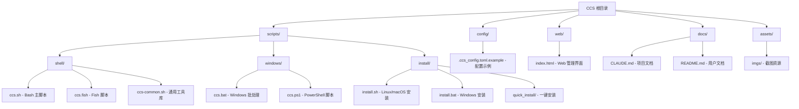
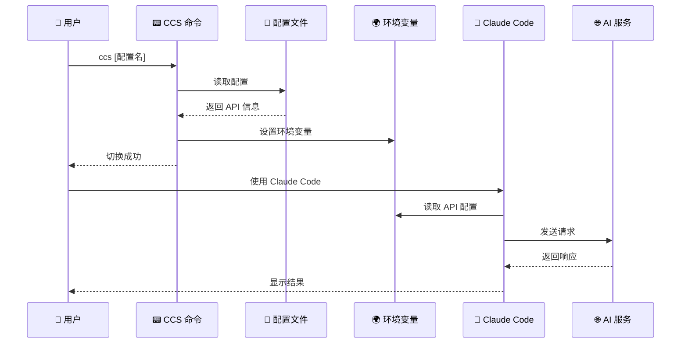

# CLAUDE.md

This file provides guidance to Claude Code (claude.ai/code) when working with code in this repository.

## Project Overview

CCS (Claude Code Configuration Switcher) 是一个用于快速切换不同 Claude Code API 配置的命令行工具。它支持多种环境包括 Linux/macOS shell 环境（Bash、Zsh、Fish）和 Windows 环境（CMD、PowerShell），使用 TOML 配置文件来管理 API 设置。

### 项目愿景

为开发者提供一个简单、可靠、跨平台的 Claude Code API 配置管理工具，支持：
- 快速切换不同的 AI 服务提供商
- 全局配置持久化
- 友好的 Web 管理界面
- 智能的模型选择策略

## Architecture Overview

### 核心架构

CCS 采用模块化设计，主要包含以下组件：



### 模块索引

| 模块 | 路径 | 责任 | 关键文件 |
|------|------|------|----------|
| **Shell 脚本** | `scripts/shell/` | Linux/macOS 核心功能 | `ccs.sh`, `ccs.fish`, `ccs-common.sh` |
| **Windows 脚本** | `scripts/windows/` | Windows 环境支持 | `ccs.bat`, `ccs.ps1` |
| **安装系统** | `scripts/install/` | 跨平台安装和配置 | `install.sh`, `install.bat` |
| **配置管理** | `config/` | 配置文件模板 | `.ccs_config.toml.example` |
| **Web 界面** | `web/` | 图形化管理界面 | `index.html` |
| **文档** | `docs/` | 详细文档 | 各种 `.md` 文件 |

### 核心工作流程



## Key Components

### 1. Shell 脚本模块 (`scripts/shell/`)

#### ccs.sh (Bash 主脚本)
- **入口点**: `ccs()` 主函数
- **核心功能**: 配置解析、环境变量设置、配置切换
- **特殊功能**: 自动加载当前配置、版本显示、Web 界面启动
- **关键函数**:
  - `parse_toml()` - 解析 TOML 配置
  - `list_configs()` - 列出所有配置
  - `show_current()` - 显示当前配置
  - `update_current_config()` - 更新当前配置状态
  - `load_current_config()` - 自动加载当前配置

#### ccs.fish (Fish 脚本)
- **功能**: 与 Bash 版本等效的 Fish shell 实现
- **特殊功能**: Fish 自动补全 (`__ccs_complete`)
- **关键函数**:
  - `set_config_env()` - 设置配置环境变量
  - `update_current_config()` - 更新当前配置
  - `load_current_config()` - 自动加载当前配置

#### ccs-common.sh (通用工具库)
- **功能**: 跨平台共享工具函数
- **关键模块**:
  - 错误处理 (`handle_error()`)
  - 日志系统 (`log_debug()`, `log_info()`, `log_warn()`, `log_error()`)
  - 配置验证 (`validate_config_file()`, `validate_toml_syntax()`)
  - 文件操作 (`backup_file()`, `restore_file()`)
  - 网络检查 (`check_network_connectivity()`)
  - 系统信息 (`get_system_info()`, `get_shell_type()`)

### 2. Windows 脚本模块 (`scripts/windows/`)

#### ccs.ps1 (PowerShell 脚本)
- **功能**: Windows PowerShell 环境支持
- **关键函数**:
  - `Parse-Toml()` - TOML 配置解析
  - `List-Configs()` - 列出配置
  - `Show-Current()` - 显示当前配置
  - `Uninstall-CCS()` - 卸载功能

#### ccs.bat (批处理脚本)
- **功能**: Windows CMD 环境支持
- **特点**: 纯批处理实现，兼容 Windows 7+
- **关键函数**:
  - `:parse_toml` - 配置解析
  - `:list_configs` - 列出配置
  - `:show_current` - 显示当前配置
  - `:ccs_uninstall` - 卸载功能

### 3. 安装系统 (`scripts/install/`)

#### install.sh (Linux/macOS 安装)
- **功能**: 跨平台安装和配置
- **关键功能**:
  - Shell 类型检测 (`detect_shell()`)
  - 配置文件创建和验证
  - 脚本文件复制和权限设置
  - Shell 配置文件更新 (`.bashrc`, `.zshrc`, Fish 配置)

#### install.bat (Windows 安装)
- **功能**: Windows 环境安装
- **关键功能**:
  - PowerShell 配置
  - PATH 环境变量设置
  - 脚本文件复制
  - 注册表操作

### 4. 配置系统

#### 配置文件结构
```toml
default_config = "anyrouter"
current_config = "anyrouter"  # 自动管理

[anyrouter]
description = "AnyRouter API服务"
base_url = "https://anyrouter.top"
auth_token = "sk-your-api-key"
model = ""  # 可选，留空使用默认模型
small_fast_model = ""  # 可选
```

#### 环境变量管理
- `ANTHROPIC_BASE_URL` - API 端点
- `ANTHROPIC_AUTH_TOKEN` - API 认证令牌
- `ANTHROPIC_MODEL` - 主要模型
- `ANTHROPIC_SMALL_FAST_MODEL` - 快速模型

### 5. Web 界面 (`web/`)

#### index.html
- **功能**: 图形化配置管理界面
- **特性**:
  - 响应式设计
  - 实时配置编辑
  - 配置验证
  - 本地存储支持

## Configuration System

### 配置文件位置
- **Linux/macOS**: `~/.ccs_config.toml`
- **Windows**: `%USERPROFILE%\.ccs_config.toml`

### 支持的配置项
- `default_config` - 默认配置名称
- `current_config` - 当前活跃配置（自动管理）
- `[config_name]` - 配置节
  - `description` - 配置描述
  - `base_url` - API 端点
  - `auth_token` - API 认证令牌
  - `model` - 模型名称（可选）
  - `small_fast_model` - 快速模型（可选）

### 智能模型选择策略
- **Claude API 服务**: 建议留空 `model` 字段，使用 Claude Code 默认模型
- **非 Claude 服务**: 必须明确指定 `model` 字段

## Development and Testing

### 开发命令
```bash
# 测试安装脚本
./scripts/install/install.sh

# 测试快速安装
./scripts/install/quick_install/quick_install.sh

# 测试卸载功能
./scripts/install/install.sh --uninstall

# 测试 Shell 脚本
source ./scripts/shell/ccs.sh
ccs list
ccs current
ccs help
```

### 配置测试
创建测试配置文件并验证：
- 配置解析正确性
- 环境变量设置
- 默认配置处理
- 错误处理机制

## Running and Development

### 安装过程
1. 创建 `~/.ccs/` 目录
2. 复制脚本到 `~/.ccs/`
3. 创建 `~/.ccs_config.toml` 配置文件
4. 更新 Shell 配置文件
5. 设置文件权限

### 使用方法
```bash
ccs list              # 列出所有配置
ccs [配置名称]        # 切换到指定配置
ccs current          # 显示当前配置
ccs web              # 启动 Web 管理界面
ccs version          # 显示版本信息
ccs uninstall        # 卸载工具
ccs help             # 显示帮助
```

## Testing Strategy

### 测试覆盖范围
- **功能测试**: 所有核心命令功能
- **兼容性测试**: 多 Shell 环境（Bash、Zsh、Fish）
- **平台测试**: Linux、macOS、Windows
- **安装测试**: 完整安装和卸载流程
- **配置测试**: 各种配置格式和错误情况

### 测试方法
- 手动测试各平台脚本
- 验证配置文件解析
- 测试环境变量设置
- 检查 Web 界面功能
- 验证安装卸载流程

## Coding Standards

### Shell 脚本规范
- 使用 `set -e` 进行错误处理
- 统一的错误码定义
- 彩色输出支持
- 详细的日志记录
- 函数文档注释

### 代码组织
- 模块化设计，避免重复代码
- 通用功能抽取到 `ccs-common.sh`
- 平台特定代码分离
- 清晰的函数命名

### 错误处理
- 统一的错误处理机制
- 详细的错误信息
- 建议的解决方案
- 适当的错误码

## AI Usage Guidelines

### 代码修改原则
- 保持跨平台兼容性
- 遵循现有代码风格
- 添加适当的错误处理
- 更新相关文档

### 功能添加建议
- 优先考虑用户体验
- 保持配置格式兼容性
- 添加适当的测试覆盖
- 更新相关文档

## Change Log (Changelog)

### 2025-08-28 23:46:58
- ✨ 初始化项目架构文档
- 📝 完善模块索引和导航
- 🔧 添加 Mermaid 结构图
- 📋 补充开发测试指南

## Coverage Analysis

### 扫描覆盖范围
- ✅ 核心脚本文件 (100%)
- ✅ 配置文件和示例 (100%)
- ✅ Web 界面文件 (100%)
- ✅ 安装脚本 (100%)
- ✅ 文档文件 (100%)

### 文件统计
- **总文件数**: ~25 个核心文件
- **Shell 脚本**: 4 个
- **Windows 脚本**: 2 个
- **安装脚本**: 4 个
- **配置文件**: 1 个
- **Web 文件**: 1 个
- **文档文件**: 12 个

### 建议的下一步
1. 📋 创建各模块的详细 CLAUDE.md 文档
2. 🧪 完善自动化测试脚本
3. 📚 补充 API 参考文档
4. 🎨 优化 Web 界面功能
5. 🔍 添加更多错误处理和日志记录