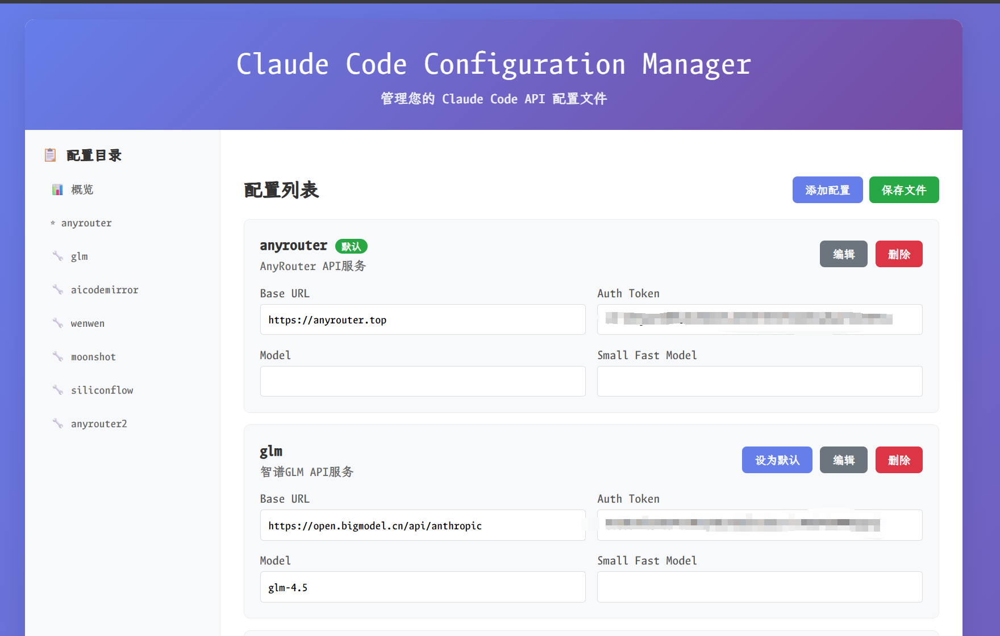

# Claude Code Configuration Switcher (CCS)

一个用于快速切换不同Claude Code API配置的工具，支持多种Shell环境和Windows环境。


## 🚀 快速安装

### Linux/macOS
```bash
curl -L https://github.com/bahayonghang/ccs/raw/main/quick_install.sh | bash
```

### Windows
下载并运行：https://github.com/bahayonghang/ccs/raw/main/quick_install.bat

### 安装后配置
1. 重新打开终端
2. 编辑配置文件：`~/.ccs_config.toml`
3. 填入API密钥并开始使用

## ✨ 功能特性

- 🔄 快速切换Claude Code API配置
- 🌐 Web界面管理
- 🔧 支持多平台和多Shell环境
- 📝 TOML配置格式

## 📝 配置文件

配置文件位于 `~/.ccs_config.toml`：

```toml
default_config = "anthropic"

[anthropic]
description = "Anthropic官方API"
base_url = "https://api.anthropic.com"
auth_token = "sk-ant-your-api-key-here"
model = "claude-3-sonnet-20240229"
small_fast_model = "claude-3-5-haiku-20241022"

[openai]
description = "OpenAI API配置"
base_url = "https://api.openai.com/v1"
auth_token = "sk-your-api-key-here"
model = "gpt-4"
```

## 📖 使用方法

```bash
ccs list              # 列出所有配置
ccs [配置名称]        # 切换到指定配置
ccs current          # 显示当前配置
ccs web              # 启动Web管理界面
ccs uninstall        # 卸载工具
ccs help             # 显示帮助
ccs                  # 使用默认配置
```

## 🌐 Web界面管理



```bash
ccs web  # 启动Web管理界面
```

通过浏览器访问显示的地址（如 `http://localhost:8888`），可以：
- 可视化管理所有配置
- 在线编辑配置参数
- 实时保存修改

## 🗂️ 文件结构

```
~/.ccs/                    # 配置目录
├── ccs.sh/.fish/.bat/.ps1 # 各平台脚本
└── web/index.html         # Web界面

~/.ccs_config.toml         # 配置文件
```

## 🗑️ 卸载

```bash
ccs uninstall  # 推荐方式
```

或使用安装脚本：
```bash
./install.sh --uninstall
```

## 🔧 环境变量

ccs会自动设置以下环境变量：
- `ANTHROPIC_BASE_URL`
- `ANTHROPIC_AUTH_TOKEN` 
- `ANTHROPIC_MODEL`
- `ANTHROPIC_SMALL_FAST_MODEL`（可选）

## 📄 许可证

MIT License