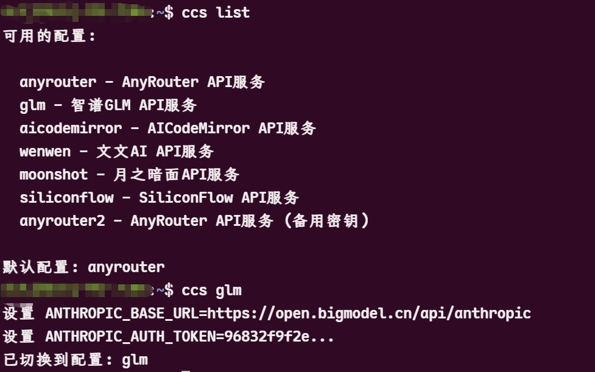

# Claude Code Configuration Switcher (CCS) v2.0

Quickly switch between different Claude Code API configurations with one command. Cross-platform support for Linux, macOS, and Windows.

[](https://opensource.org/licenses/MIT)
[](#)

English | [中文](README_CN.md)



## 🚀 Quick Start

### Installation

**Linux/macOS:**
```bash
curl -L https://github.com/bahayonghang/ccs/raw/main/scripts/install/quick_install/quick_install.sh | bash
```

**Windows PowerShell:**
```powershell
irm https://github.com/bahayonghang/ccs/raw/main/scripts/install/quick_install/quick_install.ps1 | iex
```

### Setup
1. Restart your terminal
2. Edit `~/.ccs_config.toml` and add your API keys
3. Start using: `ccs list` → `ccs [config_name]`

## 🍎 macOS Special Handling

**Fish Shell Only Strategy**: On macOS systems, CCS implements a fish-only installation strategy to ensure optimal compatibility:

- **Automatic Detection**: Installation script automatically detects macOS environment
- **Fish-Only Configuration**: Only configures Fish shell, skipping Bash and Zsh integration
- **Bash 3.2 Compatibility**: Handles macOS default Bash 3.2 limitations (no associative arrays)
- **Clean Installation**: Removes any existing Bash scripts to maintain clean fish-only setup
- **Zero Impact**: Leaves existing Bash/Zsh configurations completely untouched

**Why Fish-Only on macOS?**
- macOS ships with outdated Bash 3.2 (lacks modern features)
- Fish provides superior user experience and modern shell features
- Avoids compatibility issues with legacy shell versions
- Maintains clean separation between different shell environments

**Installation Behavior on macOS:**
```bash
# During installation, you'll see:
"🍎 macOS detected - configuring Fish shell only"
"⚠️  Skipping Bash/Zsh configuration (Fish-only strategy)"
"✅ Fish shell configured successfully"
```

**Verification:**
```bash
# Check installation result
ls ~/.ccs/          # Should only show ccs.fish (no ccs.sh)
grep ccs ~/.zshrc   # Should return "No CCS configuration found"
fish -c "ccs version"  # Should work perfectly
```

## ✨ Features

- 🔄 **One-Command Switching** - Switch between API providers instantly
- 🌐 **Web Interface** - Visual configuration management
- 🔧 **Cross-Platform** - Works on Linux, macOS, Windows
- 🐚 **Multi-Shell** - Supports Bash, Zsh, Fish, PowerShell
- 🔗 **Global Persistence** - Configuration persists across all terminals
- 📝 **Simple Config** - Human-readable TOML format

## 📝 Configuration

Edit `~/.ccs_config.toml`:

```toml
default_config = "anthropic"

[anthropic]
description = "Anthropic Official API"
base_url = "https://api.anthropic.com"
auth_token = "sk-ant-your-api-key-here"

[openai]
description = "OpenAI API"
base_url = "https://api.openai.com/v1"
auth_token = "sk-your-openai-api-key-here"
model = "gpt-4"

[custom]
description = "Custom API Provider"
base_url = "https://your-api-provider.com"
auth_token = "your-api-key-here"
```

**Key Fields:**
- `base_url`: API endpoint
- `auth_token`: Your API key
- `model`: Model name (optional for Claude APIs)

## 📖 Usage

```bash
# Basic usage
ccs [config_name]           # Switch to specific configuration
ccs list                    # List all available configurations
ccs current                 # Show current configuration status

# Management commands
ccs web                     # Launch Web configuration interface
ccs update                  # Auto-update CCS to latest version
ccs backup                  # Backup current configuration file
ccs verify                  # Verify configuration file integrity
ccs clear-cache             # Clear configuration cache
ccs uninstall               # Uninstall CCS tool

# Information commands
ccs version                 # Show version information
ccs help                    # Show help information

# Debug commands
ccs --debug [command]       # Run command with debug mode enabled
```

### 🔗 Global Configuration Persistence

CCS supports global configuration persistence, solving traditional environment variable scope limitations:

```bash
# Terminal 1
ccs glm              # Switch to GLM configuration

# Terminal 2 (newly opened)
echo $ANTHROPIC_MODEL # Automatically displays: glm-4
```

- ✅ Switch configuration in any terminal, other new terminals automatically inherit
- ✅ Configuration remains unchanged after computer restart
- ✅ Support for multiple shells like Bash, Zsh, Fish

## 🔄 Auto-Update

CCS provides convenient auto-update functionality, eliminating the need to manually execute complex installation commands:

```bash
ccs update                  # Auto-update to latest version
```

### Update Features

- ✅ **Smart Path Detection** - Automatically searches for installation script locations
- ✅ **Configuration Protection** - Automatically backs up existing configuration files
- ✅ **Complete Update** - Updates all script files and web interface
- ✅ **Environment Refresh** - Automatically refreshes shell environment configuration
- ✅ **Error Handling** - Detailed error messages and solution suggestions

### Update Process

1. **Search Installation Script** - Looks for `install.sh` in multiple possible locations
2. **Backup Configuration** - Automatically backs up current configuration to `~/.ccs/backups/`
3. **Execute Update** - Runs installation script to update all components
4. **Verify Completion** - Confirms successful update and provides follow-up instructions

### Important Notes

⚠️ **Post-Update Actions**:
- Restart terminal, or run `source ~/.bashrc` (Bash) / `source ~/.config/fish/config.fish` (Fish)
- Run `ccs version` to confirm version update success

⚠️ **Troubleshooting**:
- Ensure running in CCS project directory, or ensure default installation path exists
- Check network connection and disk space
- If update fails, manually run: `cd /path/to/ccs && ./scripts/install/install.sh`

## 🛠️ Advanced Features

### 🏎️ Performance Optimization (v2.0)

- **Configuration Caching**: Smart caching system reduces parsing time by 5x
- **Fast TOML Parser**: Optimized configuration file parsing algorithm
- **Memory Management**: Efficient memory usage for large configuration files
- **Background Loading**: Asynchronous configuration loading for better responsiveness

### 🔍 System Diagnostics

```bash
ccs diagnose           # Run comprehensive system diagnostics
ccs status            # Show system status overview
ccs cache-stats       # Display cache performance statistics
ccs --debug [command] # Run commands in debug mode
```

### 🌐 Web Interface

```bash
ccs web               # Launch web configuration interface
```

- **Visual Configuration**: Point-and-click configuration management
- **Real-time Validation**: Instant configuration validation and error checking
- **Import/Export**: Easy configuration backup and sharing

### 🔄 Backup and Recovery

```bash
ccs backup            # Backup current configuration
ccs restore [file]    # Restore configuration from backup
```

- **Automatic Backup**: Configuration changes are automatically backed up
- **Version Control**: Multiple backup versions with timestamps
- **Safe Recovery**: Rollback to previous configurations safely
- **Cross-platform**: Backup files work across different operating systems

### 🧪 Configuration Testing

```bash
ccs test-config [name] # Test configuration connectivity
```

- **Network Testing**: Verify API endpoint connectivity
- **Authentication Check**: Validate API keys and tokens
- **Performance Metrics**: Measure response times and latency
- **Error Diagnosis**: Detailed error reporting and solutions

## 📁 Architecture

### Cross-platform Support

CCS provides native support for all major platforms with automatic shell integration.

## 🔧 Development

### Building from Source

```bash
git clone https://github.com/bahayonghang/ccs.git
cd ccs
make install  # or: just install
```

### Testing

```bash
make test          # Run basic functionality tests
make test-all      # Test all shell scripts
make check-syntax  # Check script syntax
```

### Development Commands

```bash
just --list        # Show all available commands
just install       # Install CCS to system
just test          # Run tests
just web           # Start web interface
```

## 📊 Performance

CCS is optimized for speed with configuration switching typically under 50ms and minimal memory usage.

## 🛡️ Security

- **Sensitive Information Masking**: API keys are never displayed in full
- **Secure File Permissions**: Configuration files have restricted permissions (600)
- **No Telemetry**: No data collection or external communication
- **Local Processing**: All operations performed locally

## 🆘 Troubleshooting

### Common Issues

**Command not found after installation**
```bash
source ~/.bashrc  # or appropriate shell config
# If still not working, check PATH and reinstall
```

**Configuration not persisting**
```bash
ccs diagnose      # Run system diagnostics
ccs status        # Check system status
```

**Web interface not working**
```bash
# Check Python availability
python3 --version
# Install Python if needed
# Check firewall settings
```

**Permission denied errors**
```bash
# Check file permissions
ls -la ~/.ccs_config.toml
# Fix permissions
chmod 600 ~/.ccs_config.toml
```

### Debug Mode

Enable debug mode for detailed troubleshooting:
```bash
ccs --debug list           # Debug mode for list command
ccs --debug current        # Debug mode for current command
LOG_LEVEL=DEBUG ccs list   # Environment variable debug
```

## 🤝 Contributing

We welcome contributions! Please see our [Contributing Guide](CONTRIBUTING.md) for details.

### Development Setup

```bash
git clone https://github.com/bahayonghang/ccs.git
cd ccs
# Set up development environment
./scripts/dev/setup.sh
```

### Code Style

- Follow existing code conventions
- Add tests for new features
- Update documentation as needed
- Ensure cross-platform compatibility

## 📋 License

This project is licensed under the MIT License - see the [LICENSE](LICENSE) file for details.

## 🙏 Acknowledgments

- **Claude Code** - For the amazing AI coding assistant
- **Open Source Community** - For tools and inspiration
- **Contributors** - For bug reports, feature requests, and code contributions

## 📞 Support

- **Issues**: [GitHub Issues](https://github.com/bahayonghang/ccs/issues)
- **Discussions**: [GitHub Discussions](https://github.com/bahayonghang/ccs/discussions)
- **Documentation**: [Wiki](https://github.com/bahayonghang/ccs/wiki)
- **Releases**: [Releases](https://github.com/bahayonghang/ccs/releases)

---

**⭐ If this project helps you, please give it a star!**

**🔄 CCS - Making Claude Code Configuration Management Simple and Efficient**