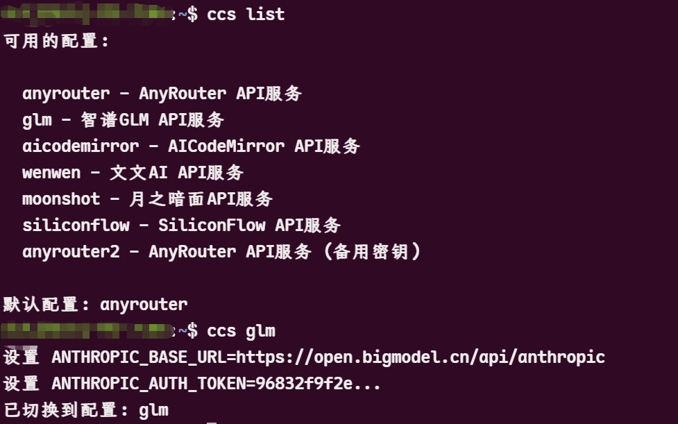

# Claude Code Configuration Switcher (CCS)

一个用于快速切换不同Claude Code API配置的工具，支持多种Shell环境（Bash、Zsh、Fish）。

> Attention: 暂时只支持bash，zsh，fish，其他shell环境未测试通过，可能会出现问题。

## 🚀 一键安装

```bash
curl -L https://github.com/bahayonghang/ccs/raw/main/quick_install.sh | bash
```

**或者使用 wget：**

```bash
wget -qO- https://github.com/bahayonghang/ccs/raw/main/quick_install.sh | bash
```

> 💡 一键安装会自动下载所有必要文件并完成配置，无需手动克隆仓库

## 📋 安装后配置

安装完成后，请按照以下步骤配置：

1. **重新加载Shell环境**（选择对应的命令）：
   ```bash
   source ~/.bashrc      # Bash用户
   source ~/.zshrc       # Zsh用户  
   source ~/.config/fish/config.fish  # Fish用户
   ```

2. **编辑配置文件**：
   ```bash
   nano ~/.ccs_config.toml   # 或使用 vim
   ```

3. **填入您的API密钥**，然后开始使用：
   ```bash
   ccs list              # 查看所有配置
   ccs [配置名称]        # 切换到指定配置
   ccs current          # 显示当前配置
   ```

---

## 功能特性

- 🔄 **快速切换配置**：一键切换不同的Claude Code API配置
- 📋 **配置管理**：列出所有可用配置，显示当前配置状态
- 🔧 **多Shell支持**：支持Bash、Zsh、Fish Shell
- 📝 **TOML配置**：使用易读的TOML格式管理配置
- 🎨 **彩色输出**：带颜色的友好提示信息

## 📦 安装方式

### 方式一：一键安装（推荐）

```bash
curl -L https://github.com/bahayonghang/ccs/raw/main/quick_install.sh | bash
```

**或者使用 wget：**

```bash
wget -qO- https://github.com/bahayonghang/ccs/raw/main/quick_install.sh | bash
```

### 方式二：手动安装

#### 自动安装

克隆仓库并运行安装脚本：

```bash
git clone https://github.com/bahayonghang/ccs.git
cd ccs
./install.sh
```

安装脚本会自动：
1. 创建必要的目录结构
2. 复制脚本文件
3. 创建配置文件
4. 配置Shell环境

#### 完全手动安装

1. 创建配置目录：
```bash
mkdir -p ~/.ccs
```

2. 复制脚本文件：
```bash
cp ccs.sh ~/.ccs/ccs.sh
chmod +x ~/.ccs/ccs.sh
```

3. 创建配置文件：
```bash
cp .ccs_config.toml.example ~/.ccs_config.toml
```

4. 配置Shell环境（以Bash为例）：
```bash
echo 'source ~/.ccs/ccs.sh' >> ~/.bashrc
source ~/.bashrc
```

## 配置文件

配置文件位于 `~/.ccs_config.toml`，使用TOML格式：

```toml
default_config = "openai"

[openai]
description = "OpenAI API配置"
base_url = "https://api.openai.com/v1"
auth_token = "sk-your-api-key-here"
model = "gpt-4"

[anthropic]
description = "Anthropic官方API"
base_url = "https://api.anthropic.com"
auth_token = "sk-ant-your-api-key-here"
model = "claude-3-sonnet-20240229"
small_fast_model = "claude-3-5-haiku-20241022"

[glm]
description = "智谱GLM API"
base_url = "https://open.bigmodel.cn/api/paas/v4"
auth_token = "your-glm-api-key"
model = "glm-4"
```

## 使用方法

### 基本命令

```bash
# 列出所有可用配置
ccs list

# 切换到指定配置
ccs openai
ccs anthropic
ccs glm

# 显示当前配置
ccs current

# 显示帮助信息
ccs help
```

### 默认配置

如果不指定配置名称，ccs会使用配置文件中的`default_config`值：

```bash
# 使用默认配置
ccs
```

## 支持的Shell

- ✅ **Bash**：完全支持
- ✅ **Zsh**：完全支持
- ⚠️ **Fish**：正在调试中，部分功能可能不稳定

## 文件结构

```
~/.ccs/                    # 配置目录
├── ccs.sh                 # 主脚本文件
└── ccs.fish               # Fish Shell版本（开发中）

~/.ccs_config.toml         # 配置文件
```

## 卸载

运行卸载命令：

```bash
./install.sh --uninstall
```

或手动删除：

1. 删除配置目录：
```bash
rm -rf ~/.ccs
```

2. 删除配置文件：
```bash
rm ~/.ccs_config.toml
```

3. 从Shell配置文件中移除相关配置

## 环境变量

ccs会设置以下环境变量：

- `ANTHROPIC_BASE_URL`：API基础URL
- `ANTHROPIC_AUTH_TOKEN`：API认证令牌
- `ANTHROPIC_MODEL`：使用的模型名称
- `ANTHROPIC_SMALL_FAST_MODEL`：用于背景任务的快速模型（可选）

## 配置选项说明

### 基本配置项
- `base_url`: API服务的基础URL
- `auth_token`: API认证令牌
- `model`: 主要使用的模型名称
- `description`: 配置的描述信息

### 可选配置项
- `small_fast_model`: 用于Claude Code背景任务的快速模型，推荐使用Haiku系列：
  - `claude-3-5-haiku-20241022`（最新版本）
  - `claude-3-haiku-20240307`（旧版本）

## 故障排除

### 常见问题

1. **配置文件不存在**
   - 确保配置文件 `~/.ccs_config.toml` 存在
   - 如果不存在，请重新运行安装脚本

2. **命令不存在**
   - 重新启动终端或重新加载Shell配置
   - 运行 `source ~/.bashrc` 或 `source ~/.zshrc`

3. **Fish Shell问题**
   - Fish Shell支持正在调试中
   - 建议暂时使用Bash或Zsh

### 调试模式

如果遇到问题，可以查看脚本输出：

```bash
# 直接运行脚本查看详细输出
bash ~/.ccs/ccs.sh
```

## 贡献

欢迎提交Issue和Pull Request来改进这个工具。

## 许可证

MIT License

## 更新日志

### v1.0.0
- 初始版本
- 支持Bash、Zsh、Fish Shell
- TOML配置文件支持
- 基本的配置切换功能