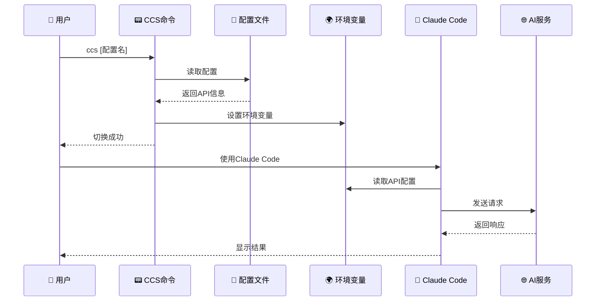

# Claude Code Configuration Switcher (CCS)

一个用于快速切换不同Claude Code API配置[供应商切换]的工具,支持多种Shell环境[暂时不支持Windows]。


## 🚀 快速安装

### Linux/macOS
```bash
curl -L https://github.com/bahayonghang/ccs/raw/main/scripts/install/quick_install/quick_install.sh | bash
```

### Windows
下载并运行：https://github.com/bahayonghang/ccs/raw/main/scripts/install/quick_install/quick_install.bat

### 安装后配置
1. 重新打开终端（自动加载当前配置）
2. 编辑配置文件：`~/.ccs_config.toml`
3. 填入API密钥并开始使用

## ✨ 功能特性

- 🔄 快速切换Claude Code API配置
- 🌐 Web界面管理
- 🔧 支持多平台和多Shell环境
- 📝 TOML配置格式
- 🔗 **全局配置持久化** - 在一个终端切换配置,所有新终端自动继承
- 🎯 **智能模型选择** - Claude服务可使用默认模型,其他服务指定模型

## 📝 配置文件

配置文件位于 `~/.ccs_config.toml`,示例配置文件在 `config/.ccs_config.toml.example`：

```toml
default_config = "anyrouter"

# 当前活跃配置（自动管理,请勿手动修改）
current_config = "anyrouter"

[anyrouter]
description = "AnyRouter API服务"
base_url = "https://anyrouter.top"
auth_token = "sk-your-anyrouter-api-key-here"
# model = ""  # 留空使用默认Claude模型
# small_fast_model = ""  # 留空使用默认快速模型

[glm]
description = "智谱GLM API服务"
base_url = "https://open.bigmodel.cn/api/paas/v4"
auth_token = "your-glm-api-key-here"
model = "glm-4"

[anthropic]
description = "Anthropic官方API"
base_url = "https://api.anthropic.com"
auth_token = "sk-ant-your-api-key-here"
# model = ""  # 留空使用默认Claude模型
# small_fast_model = ""  # 留空使用默认快速模型

[openai]
description = "OpenAI API配置"
base_url = "https://api.openai.com/v1"
auth_token = "sk-your-openai-api-key-here"
model = "gpt-4"
```

### 🔧 配置字段说明

- `default_config`: 默认配置名称
- `current_config`: 当前活跃配置（自动管理,无需手动修改）
- `base_url`: API端点地址
- `auth_token`: API认证令牌
- `model`: 指定模型名称（可选）
  - 如果留空或注释,Claude API服务将使用默认模型
  - 对于非Claude服务（如GLM、OpenAI）,建议明确指定模型
- `small_fast_model`: 快速模型名称（可选）

### 🎯 模型配置策略

- **Claude API服务**（anyrouter、anthropic、aicodemirror等）：建议留空`model`字段,使用Claude Code工具的默认模型选择
- **非Claude服务**（glm、openai、moonshot等）：明确指定`model`字段以确保兼容性

## 📖 使用方法

```bash
ccs list              # 列出所有配置
ccs [配置名称]        # 切换到指定配置（全局生效）
ccs current          # 显示当前配置
ccs web              # 启动Web管理界面
ccs uninstall        # 卸载工具
ccs help             # 显示帮助
ccs                  # 使用当前活跃配置
```

### 🔗 全局配置持久化

CCS支持全局配置持久化,解决了传统环境变量作用域限制：

```bash
# 终端1
ccs glm              # 切换到GLM配置

# 终端2（新打开）
echo $ANTHROPIC_MODEL # 自动显示: glm-4.5
```

- ✅ 在任意终端切换配置,其他新终端自动继承
- ✅ 重启电脑后配置保持不变
- ✅ 支持Bash、Zsh、Fish等多种Shell

## 🌐 Web界面管理


```bash
ccs web  # 启动Web管理界面
```

通过浏览器访问显示的地址（如 `http://localhost:8888`）,可以：
- 可视化管理所有配置
- 在线编辑配置参数
- 实时保存修改

## 🏗️ 项目架构

### 核心工作流程



## 🗂️ 项目结构

```
ccs/
├── scripts/                    # 脚本文件目录
│   ├── shell/                 # Shell脚本
│   │   ├── ccs.sh            # Bash脚本
│   │   └── ccs.fish          # Fish脚本
│   ├── windows/              # Windows脚本
│   │   ├── ccs.bat           # 批处理脚本
│   │   └── ccs.ps1           # PowerShell脚本
│   └── install/              # 安装脚本
│       ├── install.sh        # Linux/macOS安装
│       ├── install.bat       # Windows安装
│       └── quick_install/    # 一键安装
│           ├── quick_install.sh
│           └── quick_install.bat
├── config/                    # 配置文件目录
│   └── ccs_config.toml.example  # 示例配置文件
├── web/                       # Web界面
│   └── index.html
├── docs/                      # 文档目录
│   └── CLAUDE.md
├── assets/                    # 资源文件目录
│   └── imgs/
│       ├── screenshot1.png
│       └── screenshot2.png
├── README.md                  # 项目说明文档
└── package.json              # 项目元数据
```

## 📁 安装后文件结构

```
~/.ccs/                    # 配置目录
├── ccs.sh/.fish/.bat/.ps1 # 各平台脚本
├── ccs-common.sh          # 通用工具库
└── web/index.html         # Web界面

~/.ccs_config.toml         # 配置文件
├── default_config         # 默认配置名称
├── current_config         # 当前活跃配置（自动管理）
└── [配置节]               # 各种API服务配置
```

## 🗑️ 卸载

```bash
ccs uninstall  # 推荐方式
```

或使用安装脚本：
```bash
./scripts/install/install.sh --uninstall
```

## 🔧 环境变量

ccs会自动设置以下环境变量：
- `ANTHROPIC_BASE_URL`: API端点地址
- `ANTHROPIC_AUTH_TOKEN`: API认证令牌
- `ANTHROPIC_MODEL`: 模型名称（可选,留空使用默认模型）
- `ANTHROPIC_SMALL_FAST_MODEL`: 快速模型名称（可选）

### 💡 模型设置逻辑

- **有值时**: 设置对应的环境变量
- **空值时**: 不设置环境变量,由Claude Code工具使用默认模型
- **建议**: Claude API服务留空model字段,非Claude服务明确指定model

## 🛠️ 故障排除

### Windows PowerShell 语法错误

**问题**: 在Windows中运行PowerShell时出现语法错误：
```
Missing closing ')' in expression.
Unexpected token 'PATH", $newPath, "User")' in expression or statement.
```

**解决方案**: 此问题已在最新版本中修复。如果仍遇到问题：

1. **重新安装**：
   ```powershell
   ccs uninstall
   # 然后重新运行安装脚本
   ```

2. **检查PowerShell版本**：
   ```powershell
   $PSVersionTable.PSVersion
   ```

3. **设置执行策略**（如需要）：
   ```powershell
   Set-ExecutionPolicy -ExecutionPolicy RemoteSigned -Scope CurrentUser
   ```

详细信息请参考：[POWERSHELL_FIX.md](POWERSHELL_FIX.md)

### 配置文件更新验证失败

**问题**: 切换配置时显示"❌ 配置文件更新验证失败"但功能正常。

**原因**: 早期版本的配置验证逻辑在某些情况下可能误报失败。

**解决方案**: 此问题已在最新版本中修复,使用了更健壮的验证方法。如果仍遇到问题：

1. **更新脚本**：
   ```bash
   cp scripts/shell/ccs.sh ~/.ccs/
   ```

2. **重新测试配置切换**：
   ```bash
   ccs list
   ccs [配置名称]
   ```

### 其他常见问题

- **配置文件不存在**: 运行安装脚本重新创建配置文件
- **命令未找到**: 重新打开终端或检查PATH环境变量
- **API连接失败**: 检查网络连接和API密钥是否正确

## 📄 许可证

MIT License