# Claude Code Configuration Switcher (CCS)

一个用于快速切换不同Claude Code API配置的工具，支持多种Shell环境和Windows环境。


## 🚀 快速安装

### Linux/macOS
```bash
curl -L https://github.com/bahayonghang/ccs/raw/main/scripts/install/quick_install/quick_install.sh | bash
```

### Windows
下载并运行：https://github.com/bahayonghang/ccs/raw/main/scripts/install/quick_install/quick_install.bat

### 安装后配置
1. 重新打开终端（自动加载当前配置）
2. 编辑配置文件：`~/.ccs_config.toml`
3. 填入API密钥并开始使用

## ✨ 功能特性

- 🔄 快速切换Claude Code API配置
- 🌐 Web界面管理
- 🔧 支持多平台和多Shell环境
- 📝 TOML配置格式
- 🔗 **全局配置持久化** - 在一个终端切换配置，所有新终端自动继承
- 🎯 **智能模型选择** - Claude服务可使用默认模型，其他服务指定模型

## 📝 配置文件

配置文件位于 `~/.ccs_config.toml`，示例配置文件在 `config/.ccs_config.toml.example`：

```toml
default_config = "anyrouter"

# 当前活跃配置（自动管理，请勿手动修改）
current_config = "anyrouter"

[anyrouter]
description = "AnyRouter API服务"
base_url = "https://anyrouter.top"
auth_token = "sk-your-anyrouter-api-key-here"
# model = ""  # 留空使用默认Claude模型
# small_fast_model = ""  # 留空使用默认快速模型

[glm]
description = "智谱GLM API服务"
base_url = "https://open.bigmodel.cn/api/paas/v4"
auth_token = "your-glm-api-key-here"
model = "glm-4"

[anthropic]
description = "Anthropic官方API"
base_url = "https://api.anthropic.com"
auth_token = "sk-ant-your-api-key-here"
# model = ""  # 留空使用默认Claude模型
# small_fast_model = ""  # 留空使用默认快速模型

[openai]
description = "OpenAI API配置"
base_url = "https://api.openai.com/v1"
auth_token = "sk-your-openai-api-key-here"
model = "gpt-4"
```

### 🔧 配置字段说明

- `default_config`: 默认配置名称
- `current_config`: 当前活跃配置（自动管理，无需手动修改）
- `base_url`: API端点地址
- `auth_token`: API认证令牌
- `model`: 指定模型名称（可选）
  - 如果留空或注释，Claude API服务将使用默认模型
  - 对于非Claude服务（如GLM、OpenAI），建议明确指定模型
- `small_fast_model`: 快速模型名称（可选）

### 🎯 模型配置策略

- **Claude API服务**（anyrouter、anthropic、aicodemirror等）：建议留空`model`字段，使用Claude Code工具的默认模型选择
- **非Claude服务**（glm、openai、moonshot等）：明确指定`model`字段以确保兼容性

## 📖 使用方法

```bash
ccs list              # 列出所有配置
ccs [配置名称]        # 切换到指定配置（全局生效）
ccs current          # 显示当前配置
ccs web              # 启动Web管理界面
ccs uninstall        # 卸载工具
ccs help             # 显示帮助
ccs                  # 使用当前活跃配置
```

### 🔗 全局配置持久化

CCS支持全局配置持久化，解决了传统环境变量作用域限制：

```bash
# 终端1
ccs glm              # 切换到GLM配置

# 终端2（新打开）
echo $ANTHROPIC_MODEL # 自动显示: glm-4.5
```

- ✅ 在任意终端切换配置，其他新终端自动继承
- ✅ 重启电脑后配置保持不变
- ✅ 支持Bash、Zsh、Fish等多种Shell

## 🌐 Web界面管理


```bash
ccs web  # 启动Web管理界面
```

通过浏览器访问显示的地址（如 `http://localhost:8888`），可以：
- 可视化管理所有配置
- 在线编辑配置参数
- 实时保存修改

## 🏗️ 项目架构图

### 完整系统架构

```mermaid
graph TB
    %% 用户层
    subgraph "👤 用户交互层"
        U1["🖥️ 终端用户"]
        U2["🌐 Web用户"]
    end
    
    %% 接口层
    subgraph "🔌 接口层"
        CLI["📟 命令行接口<br/>ccs [command]"]
        WEB["🌐 Web界面<br/>index.html"]
    end
    
    %% 核心处理层
    subgraph "⚙️ 核心处理层"
        subgraph "🐚 Shell脚本引擎"
            BASH["🔧 ccs.sh<br/>(Bash/Zsh)"]
            FISH["🐟 ccs.fish<br/>(Fish Shell)"]
            COMMON["📚 ccs-common.sh<br/>(通用工具库)"]
        end
        
        subgraph "🪟 Windows脚本引擎"
            BAT["⚡ ccs.bat<br/>(CMD批处理)"]
            PS1["💻 ccs.ps1<br/>(PowerShell)"]
        end
    end
    
    %% 配置管理层
    subgraph "📋 配置管理层"
        CONFIG["📄 ~/.ccs_config.toml<br/>(TOML配置文件)"]
        PARSER["🔍 TOML解析器"]
        VALIDATOR["✅ 配置验证器"]
    end
    
    %% 环境变量层
    subgraph "🌍 环境变量层"
        ENV1["🔗 ANTHROPIC_BASE_URL"]
        ENV2["🔑 ANTHROPIC_AUTH_TOKEN"]
        ENV3["🤖 ANTHROPIC_MODEL"]
        ENV4["⚡ ANTHROPIC_SMALL_FAST_MODEL"]
    end
    
    %% 外部API服务
    subgraph "🌐 外部API服务"
        API1["🔮 Anthropic官方API"]
        API2["🚀 AnyRouter API"]
        API3["🧠 智谱GLM API"]
        API4["💬 OpenAI API"]
        API5["🌙 月之暗面API"]
        API6["📝 其他AI服务"]
    end
    
    %% Claude Code工具
    subgraph "🛠️ 目标应用"
        CLAUDE["🎯 Claude Code<br/>(VS Code扩展)"]
    end
    
    %% 安装部署层
    subgraph "📦 安装部署层"
        INSTALL["🔧 install.sh/bat<br/>(安装脚本)"]
        QUICK["⚡ quick_install<br/>(一键安装)"]
        UNINSTALL["🗑️ 卸载脚本"]
    end
    
    %% 文件系统
    subgraph "💾 文件系统"
        FS1["📁 ~/.ccs/<br/>(脚本目录)"]
        FS2["📄 ~/.ccs_config.toml<br/>(用户配置)"]
        FS3["📋 config/.ccs_config.toml.example<br/>(配置模板)"]
    end
    
    %% 连接关系
    U1 --> CLI
    U2 --> WEB
    
    CLI --> BASH
    CLI --> FISH
    CLI --> BAT
    CLI --> PS1
    
    WEB --> CONFIG
    
    BASH --> COMMON
    FISH --> COMMON
    BAT -.-> COMMON
    PS1 -.-> COMMON
    
    BASH --> PARSER
    FISH --> PARSER
    BAT --> PARSER
    PS1 --> PARSER
    
    PARSER --> CONFIG
    PARSER --> VALIDATOR
    VALIDATOR --> CONFIG
    
    BASH --> ENV1
    BASH --> ENV2
    BASH --> ENV3
    BASH --> ENV4
    
    FISH --> ENV1
    FISH --> ENV2
    FISH --> ENV3
    FISH --> ENV4
    
    BAT --> ENV1
    BAT --> ENV2
    BAT --> ENV3
    BAT --> ENV4
    
    PS1 --> ENV1
    PS1 --> ENV2
    PS1 --> ENV3
    PS1 --> ENV4
    
    ENV1 --> CLAUDE
    ENV2 --> CLAUDE
    ENV3 --> CLAUDE
    ENV4 --> CLAUDE
    
    CLAUDE --> API1
    CLAUDE --> API2
    CLAUDE --> API3
    CLAUDE --> API4
    CLAUDE --> API5
    CLAUDE --> API6
    
    INSTALL --> FS1
    INSTALL --> FS2
    QUICK --> INSTALL
    
    FS3 --> FS2
    FS1 --> BASH
    FS1 --> FISH
    FS1 --> BAT
    FS1 --> PS1
    FS1 --> COMMON
    FS1 --> WEB
    
    %% 样式定义
    classDef userLayer fill:#E3F2FD,stroke:#1976D2,stroke-width:2px
    classDef interfaceLayer fill:#F3E5F5,stroke:#7B1FA2,stroke-width:2px
    classDef coreLayer fill:#FFF3E0,stroke:#F57C00,stroke-width:2px
    classDef configLayer fill:#E8F5E8,stroke:#388E3C,stroke-width:2px
    classDef envLayer fill:#FFF8E1,stroke:#FBC02D,stroke-width:2px
    classDef apiLayer fill:#FCE4EC,stroke:#C2185B,stroke-width:2px
    classDef targetLayer fill:#E0F2F1,stroke:#00695C,stroke-width:2px
    classDef deployLayer fill:#F1F8E9,stroke:#558B2F,stroke-width:2px
    classDef fileLayer fill:#FAFAFA,stroke:#616161,stroke-width:2px
    
    class U1,U2 userLayer
    class CLI,WEB interfaceLayer
    class BASH,FISH,BAT,PS1,COMMON coreLayer
    class CONFIG,PARSER,VALIDATOR configLayer
    class ENV1,ENV2,ENV3,ENV4 envLayer
    class API1,API2,API3,API4,API5,API6 apiLayer
    class CLAUDE targetLayer
    class INSTALL,QUICK,UNINSTALL deployLayer
    class FS1,FS2,FS3 fileLayer
```



### 数据流架构

```mermaid
sequenceDiagram
    participant User as 👤 用户
    participant CLI as 📟 命令行
    participant Script as 🔧 脚本引擎
    participant Config as 📄 配置文件
    participant Env as 🌍 环境变量
    participant Claude as 🎯 Claude Code
    participant API as 🌐 AI服务
    
    Note over User,API: CCS配置切换流程
    
    User->>CLI: ccs anyrouter
    CLI->>Script: 解析命令参数
    Script->>Config: 读取配置文件
    Config-->>Script: 返回配置信息
    Script->>Script: 验证配置有效性
    Script->>Config: 更新current_config
    Script->>Env: 设置环境变量
    Note over Env: ANTHROPIC_BASE_URL<br/>ANTHROPIC_AUTH_TOKEN<br/>ANTHROPIC_MODEL
    Script-->>CLI: 配置切换成功
    CLI-->>User: 显示切换结果
    
    Note over User,API: Claude Code使用流程
    
    User->>Claude: 启动Claude Code
    Claude->>Env: 读取环境变量
    Env-->>Claude: 返回API配置
    Claude->>API: 发送API请求
    API-->>Claude: 返回AI响应
    Claude-->>User: 显示AI结果
    
    Note over User,API: Web界面管理流程
    
    User->>CLI: ccs web
    CLI->>Script: 启动Web服务
    Script-->>User: 打开浏览器界面
    User->>Config: 在线编辑配置
    Config->>Script: 实时保存更改
    Script->>Env: 更新环境变量
```



### 组件交互架构

```mermaid
graph LR
    subgraph "🔄 配置切换循环"
        A["📝 编辑配置"] --> B["🔍 验证配置"]
        B --> C["💾 保存配置"]
        C --> D["🌍 设置环境变量"]
        D --> E["✅ 配置生效"]
        E --> F["🎯 Claude Code使用"]
        F --> A
    end
    
    subgraph "🛠️ 工具链"
        G["📦 安装脚本"] --> H["📁 创建目录"]
        H --> I["📄 复制文件"]
        I --> J["🔗 设置PATH"]
        J --> K["✨ 安装完成"]
    end
    
    subgraph "🌐 多平台支持"
        L["🐧 Linux"] --> M["🔧 Bash脚本"]
        N["🍎 macOS"] --> M
        O["🪟 Windows"] --> P["⚡ PowerShell"]
        O --> Q["📝 批处理"]
    end
    
    style A fill:#E1F5FE
    style G fill:#F3E5F5
    style L fill:#E8F5E8
```



## 🗂️ 项目结构

```
ccs/
├── scripts/                    # 脚本文件目录
│   ├── shell/                 # Shell脚本
│   │   ├── ccs.sh            # Bash脚本
│   │   └── ccs.fish          # Fish脚本
│   ├── windows/              # Windows脚本
│   │   ├── ccs.bat           # 批处理脚本
│   │   └── ccs.ps1           # PowerShell脚本
│   └── install/              # 安装脚本
│       ├── install.sh        # Linux/macOS安装
│       ├── install.bat       # Windows安装
│       └── quick_install/    # 一键安装
│           ├── quick_install.sh
│           └── quick_install.bat
├── config/                    # 配置文件目录
│   └── ccs_config.toml.example  # 示例配置文件
├── web/                       # Web界面
│   └── index.html
├── docs/                      # 文档目录
│   └── CLAUDE.md
├── assets/                    # 资源文件目录
│   └── imgs/
│       ├── screenshot1.png
│       └── screenshot2.png
├── README.md                  # 项目说明文档
└── package.json              # 项目元数据
```

## 📁 安装后文件结构

```
~/.ccs/                    # 配置目录
├── ccs.sh/.fish/.bat/.ps1 # 各平台脚本
├── ccs-common.sh          # 通用工具库
└── web/index.html         # Web界面

~/.ccs_config.toml         # 配置文件
├── default_config         # 默认配置名称
├── current_config         # 当前活跃配置（自动管理）
└── [配置节]               # 各种API服务配置
```

## 🗑️ 卸载

```bash
ccs uninstall  # 推荐方式
```

或使用安装脚本：
```bash
./scripts/install/install.sh --uninstall
```

## 🔧 环境变量

ccs会自动设置以下环境变量：
- `ANTHROPIC_BASE_URL`: API端点地址
- `ANTHROPIC_AUTH_TOKEN`: API认证令牌
- `ANTHROPIC_MODEL`: 模型名称（可选，留空使用默认模型）
- `ANTHROPIC_SMALL_FAST_MODEL`: 快速模型名称（可选）

### 💡 模型设置逻辑

- **有值时**: 设置对应的环境变量
- **空值时**: 不设置环境变量，由Claude Code工具使用默认模型
- **建议**: Claude API服务留空model字段，非Claude服务明确指定model

## 📄 许可证

MIT License