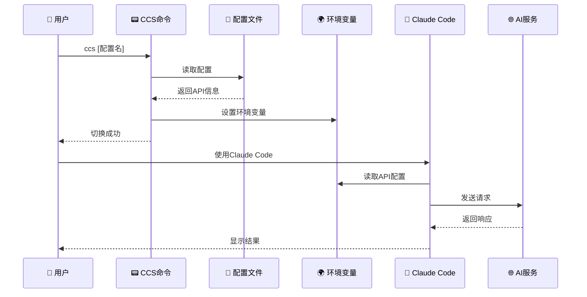

# Claude Code Configuration Switcher (CCS) v2.0

一个用于快速切换不同Claude Code API配置[供应商切换]的跨平台工具，支持多种Shell环境和操作系统。

[](https://opensource.org/licenses/MIT)
[](#)
[](#)

[English](README.md) | 中文


## 🚀 快速安装

### Linux/macOS
```bash
curl -L https://github.com/bahayonghang/ccs/raw/main/scripts/install/quick_install/quick_install.sh | bash
```

### Windows
**方法一：使用PowerShell（推荐）**
```powershell
irm https://github.com/bahayonghang/ccs/raw/main/scripts/install/quick_install/quick_install.ps1 | iex
```

**方法二：使用CMD**
```cmd
curl -L https://github.com/bahayonghang/ccs/raw/main/scripts/install/quick_install/quick_install.bat -o quick_install.bat && quick_install.bat
```

**方法三：手动下载**
下载并运行：https://github.com/bahayonghang/ccs/raw/main/scripts/install/quick_install/quick_install.bat

### 安装后配置
1. 重新打开终端（或运行 `source ~/.bashrc`）
2. 编辑配置文件：`~/.ccs_config.toml`（Windows: `%USERPROFILE%\.ccs_config.toml`）
3. 填入API密钥并开始使用：`ccs list` → `ccs [配置名]`

### 系统要求
- **Linux**: 任意主流发行版（Ubuntu、CentOS、Debian等）
- **macOS**: 10.12+ (Sierra)
- **Windows**: 7+ 支持 PowerShell 5.1+ 或 CMD
- **Shell**: Bash 4.0+、Zsh、Fish 3.0+、PowerShell 5.1+

### 安装问题排查
如果遇到安装错误，通常是网络或权限问题：
1. 确保网络连接正常，可访问GitHub
2. Linux/macOS 确保有写入 `~/.ccs` 目录的权限
3. Windows 如遇 PowerShell 执行策略问题：`Set-ExecutionPolicy RemoteSigned -Scope CurrentUser`
4. 如果问题持续，请[提交Issue](https://github.com/bahayonghang/ccs/issues)

## ✨ 功能特性

### 核心功能
- 🔄 **快速配置切换** - 一条命令切换API配置，支持多种AI服务
- 🌐 **Web界面管理** - 可视化配置管理，实时编辑保存
- 🔧 **多平台支持** - Linux、macOS、Windows全平台覆盖
- 🐚 **多Shell兼容** - Bash、Zsh、Fish、PowerShell、CMD全支持
- 📝 **TOML配置格式** - 人性化的配置文件格式，易读易写

### 高级特性
- 🔗 **全局配置持久化** - 在一个终端切换配置，所有新终端自动继承
- 🎯 **智能模型选择** - Claude服务可使用默认模型，其他服务指定模型
- ⚡ **性能优化** - 配置缓存系统，快速响应命令
- 🔒 **安全可靠** - 敏感信息掩码显示，自动备份配置
- 🛠️ **增强调试** - 详细错误提示和解决方案
- 📊 **系统检测** - 智能检测系统环境和依赖

## 📝 配置文件

配置文件位于 `~/.ccs_config.toml`,示例配置文件在 `config/.ccs_config.toml.example`：

```toml
default_config = "anyrouter"

# 当前活跃配置（自动管理,请勿手动修改）
current_config = "anyrouter"

[anyrouter]
description = "AnyRouter API服务"
base_url = "https://anyrouter.top"
auth_token = "sk-your-anyrouter-api-key-here"
# model = ""  # 留空使用默认Claude模型
# small_fast_model = ""  # 留空使用默认快速模型

[glm]
description = "智谱GLM API服务"
base_url = "https://open.bigmodel.cn/api/paas/v4"
auth_token = "your-glm-api-key-here"
model = "glm-4"

[anthropic]
description = "Anthropic官方API"
base_url = "https://api.anthropic.com"
auth_token = "sk-ant-your-api-key-here"
# model = ""  # 留空使用默认Claude模型
# small_fast_model = ""  # 留空使用默认快速模型

[openai]
description = "OpenAI API配置"
base_url = "https://api.openai.com/v1"
auth_token = "sk-your-openai-api-key-here"
model = "gpt-4"
```

### 🔧 配置字段说明

- `default_config`: 默认配置名称
- `current_config`: 当前活跃配置（自动管理,无需手动修改）
- `base_url`: API端点地址
- `auth_token`: API认证令牌
- `model`: 指定模型名称（可选）
  - 如果留空或注释,Claude API服务将使用默认模型
  - 对于非Claude服务（如GLM、OpenAI）,建议明确指定模型
- `small_fast_model`: 快速模型名称（可选）

### 🎯 模型配置策略

- **Claude API服务**（anyrouter、anthropic、aicodemirror等）：建议留空`model`字段,使用Claude Code工具的默认模型选择
- **非Claude服务**（glm、openai、moonshot等）：明确指定`model`字段以确保兼容性

## 📖 使用方法

```bash
ccs list              # 列出所有配置
ccs [配置名称]        # 切换到指定配置（全局生效）
ccs current          # 显示当前配置
ccs web              # 启动Web管理界面
ccs uninstall        # 卸载工具
ccs help             # 显示帮助
ccs                  # 使用当前活跃配置
```

### 🔗 全局配置持久化

CCS支持全局配置持久化,解决了传统环境变量作用域限制：

```bash
# 终端1
ccs glm              # 切换到GLM配置

# 终端2（新打开）
echo $ANTHROPIC_MODEL # 自动显示: glm-4
```

- ✅ 在任意终端切换配置,其他新终端自动继承
- ✅ 重启电脑后配置保持不变
- ✅ 支持Bash、Zsh、Fish等多种Shell

## 🌐 Web界面管理


```bash
ccs web  # 启动Web管理界面
```

通过浏览器访问显示的地址（如 `http://localhost:8888`）,可以：
- 可视化管理所有配置
- 在线编辑配置参数
- 实时保存修改

## 🏗️ 项目架构

### 核心工作流程



## 🗂️ 项目结构

```
ccs/
├── scripts/                    # 脚本文件目录
│   ├── shell/                 # Shell脚本
│   │   ├── ccs.sh            # Bash脚本
│   │   └── ccs.fish          # Fish脚本
│   ├── windows/              # Windows脚本
│   │   ├── ccs.bat           # 批处理脚本
│   │   └── ccs.ps1           # PowerShell脚本
│   └── install/              # 安装脚本
│       ├── install.sh        # Linux/macOS安装
│       ├── install.bat       # Windows安装
│       └── quick_install/    # 一键安装
│           ├── quick_install.sh
│           └── quick_install.bat
├── config/                    # 配置文件目录
│   └── ccs_config.toml.example  # 示例配置文件
├── web/                       # Web界面
│   └── index.html
├── docs/                      # 文档目录
├── assets/                    # 资源文件目录
│   └── imgs/
│       ├── screenshot1.png
│       └── screenshot2.png
├── README.md                  # 项目说明文档
└── package.json              # 项目元数据
```

## 📁 安装后文件结构

```
~/.ccs/                    # 配置目录
├── ccs.sh/.fish/.bat/.ps1 # 各平台脚本
├── ccs-common.sh          # 通用工具库
└── web/index.html         # Web界面

~/.ccs_config.toml         # 配置文件
├── default_config         # 默认配置名称
├── current_config         # 当前活跃配置（自动管理）
└── [配置节]               # 各种API服务配置
```

## 🗑️ 卸载

```bash
ccs uninstall  # 推荐方式
```

或使用安装脚本：
```bash
./scripts/install/install.sh --uninstall
```

## 🔧 环境变量

ccs会自动设置以下环境变量：
- `ANTHROPIC_BASE_URL`: API端点地址
- `ANTHROPIC_AUTH_TOKEN`: API认证令牌
- `ANTHROPIC_MODEL`: 模型名称（可选,留空使用默认模型）
- `ANTHROPIC_SMALL_FAST_MODEL`: 快速模型名称（可选）

### 💡 模型设置逻辑

- **有值时**: 设置对应的环境变量
- **空值时**: 不设置环境变量,由Claude Code工具使用默认模型
- **建议**: Claude API服务留空model字段,非Claude服务明确指定model

## 🛠️ 故障排除

### Windows PowerShell 语法错误

**问题**: 在Windows中运行PowerShell时出现语法错误：
```
Missing closing ')' in expression.
Unexpected token 'PATH", $newPath, "User")' in expression or statement.
```

**解决方案**: 此问题已在最新版本中修复。如果仍遇到问题：

1. **重新安装**：
   ```powershell
   ccs uninstall
   # 然后重新运行安装脚本
   ```

2. **检查PowerShell版本**：
   ```powershell
   $PSVersionTable.PSVersion
   ```

3. **设置执行策略**（如需要）：
   ```powershell
   Set-ExecutionPolicy -ExecutionPolicy RemoteSigned -Scope CurrentUser
   ```


### 配置文件更新验证失败

**问题**: 切换配置时显示"❌ 配置文件更新验证失败"但功能正常。

**原因**: 早期版本的配置验证逻辑在某些情况下可能误报失败。

**解决方案**: 此问题已在最新版本中修复,使用了更健壮的验证方法。如果仍遇到问题：

1. **更新脚本**：
   ```bash
   cp scripts/shell/ccs.sh ~/.ccs/
   ```

2. **重新测试配置切换**：
   ```bash
   ccs list
   ccs [配置名称]
   ```

### 其他常见问题

- **配置文件不存在**: 运行安装脚本重新创建配置文件
- **命令未找到**: 重新打开终端或检查PATH环境变量
- **API连接失败**: 检查网络连接和API密钥是否正确

## 🛠️ 开发和构建

项目提供了完整的构建工具来管理开发、测试和部署流程：

### 构建工具
- **Justfile** (推荐): 功能完整的任务运行器
- **Makefile** (备选): 传统的构建工具，无需额外安装

### 快速开始
```bash
# 使用 Just (推荐)
sudo snap install just  # 安装 just
just --list            # 查看所有命令
just quickstart        # 快速安装和配置

# 使用 Make (备选)
make help              # 查看所有命令
make quickstart        # 快速安装和配置
```

### 主要命令
```bash
# 安装和配置
just install           # 安装到系统
just uninstall         # 卸载

# 测试和验证
just test              # 基本测试
just test-all          # 完整测试
just check-syntax      # 语法检查

# Web界面
just web               # 启动Web管理界面

# 开发维护
just diagnose          # 系统诊断
just health-check      # 健康检查
just fix-permissions   # 修复权限
```

详细的构建和开发指南请参考：[BUILD.md](BUILD.md)

## 📄 许可证

MIT License