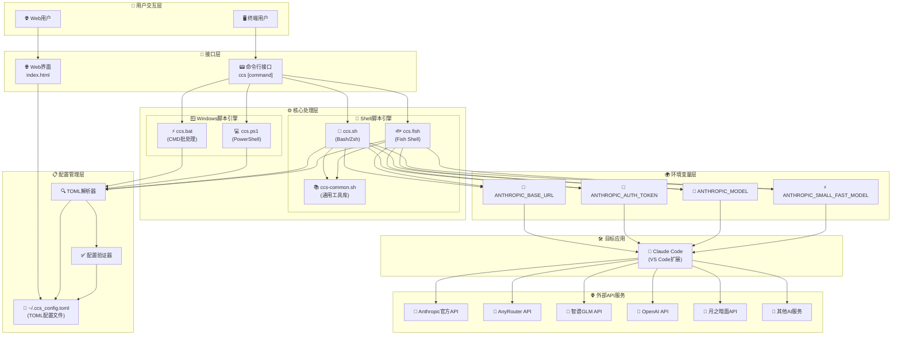
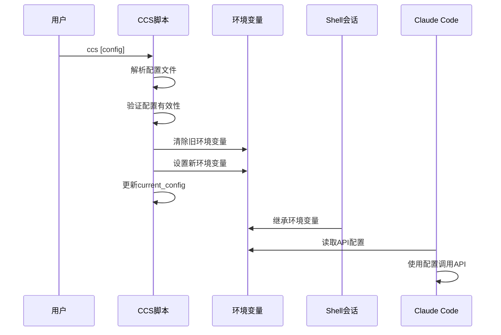
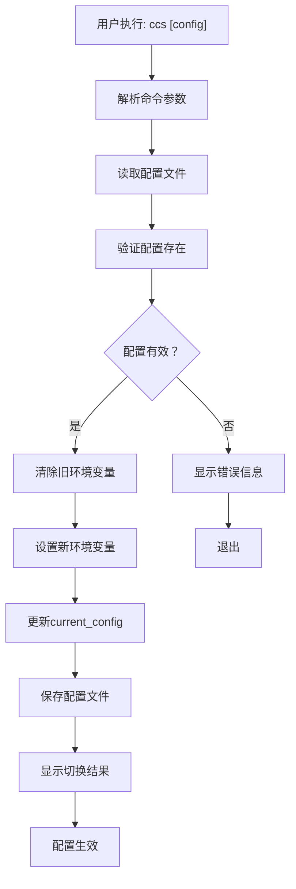
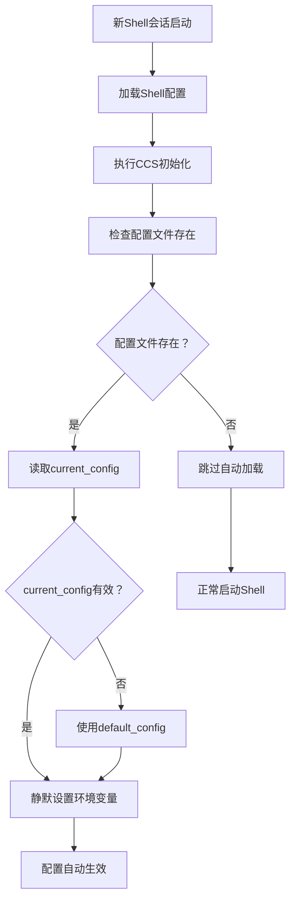

# 项目架构

CCS (Claude Code Configuration Switcher) 是一个多平台、多Shell环境的配置管理工具。本文档详细介绍其架构设计、组件关系和技术实现。

## 🏗️ 整体架构概览



## 🔧 核心组件详解

### 1. 用户交互层

#### 终端用户界面
- **功能**：通过命令行与CCS交互
- **支持Shell**：Bash、Zsh、Fish、PowerShell、CMD
- **主要命令**：`ccs list`、`ccs [config]`、`ccs current`等

#### Web用户界面
- **功能**：图形化配置管理
- **技术**：纯HTML/CSS/JavaScript，无依赖
- **特性**：实时编辑、可视化管理、自动保存

### 2. 脚本引擎层

#### Bash/Zsh脚本引擎 (`ccs.sh`)
```bash
# 核心功能模块
- 配置解析和验证
- 环境变量设置
- TOML文件操作
- 错误处理和日志
- 自动配置加载
```

**关键特性**：
- ✅ 跨平台兼容（Linux/macOS）
- ✅ 支持Bash 4.0+和Zsh
- ✅ 完整的错误处理机制
- ✅ 自动配置持久化

#### Fish脚本引擎 (`ccs.fish`)
```fish
# Fish特定实现
- Fish语法适配
- 环境变量管理
- 配置文件解析
- 用户友好的输出
```

**关键特性**：
- ✅ Fish Shell 3.0+支持
- ✅ 原生Fish语法
- ✅ 优雅的错误处理
- ✅ 与Bash版本功能对等

#### Windows脚本引擎

**批处理脚本 (`ccs.bat`)**：
```batch
# CMD批处理实现
- Windows环境变量设置
- TOML文件解析（简化版）
- 基本错误处理
- 用户交互界面
```

**PowerShell脚本 (`ccs.ps1`)**：
```powershell
# PowerShell实现
- 高级TOML解析
- 完整的错误处理
- 对象化配置管理
- 现代化用户界面
```

#### 通用工具库 (`ccs-common.sh`)
```bash
# 共享功能模块
- 颜色输出定义
- 错误码标准化
- 日志系统
- 文件操作工具
- 配置验证函数
```

**设计原则**：
- 🔄 **代码复用**：减少重复代码
- 📏 **标准化**：统一错误处理和日志格式
- 🔧 **可维护性**：集中管理通用功能
- 🧪 **可测试性**：独立的功能模块

### 3. 配置管理层

#### TOML配置文件
```toml
# 配置文件结构
[global]
default_config = "配置名"
current_config = "当前配置"

[配置节]
description = "描述"
base_url = "API地址"
auth_token = "API密钥"
model = "模型名称"
```

**设计优势**：
- 📖 **可读性强**：人类友好的格式
- 🔧 **易于编辑**：支持注释和多行
- 🛡️ **类型安全**：明确的数据类型
- 🌐 **标准化**：广泛支持的格式

#### TOML解析器
```bash
# 解析器功能
- 配置节提取
- 键值对解析
- 数据类型转换
- 语法验证
- 错误定位
```

**实现特点**：
- 🚀 **轻量级**：纯Shell实现，无外部依赖
- 🎯 **专用性**：针对CCS配置优化
- 🔍 **容错性**：友好的错误提示
- ⚡ **高效性**：快速解析和验证

#### 配置验证器
```bash
# 验证规则
- 必需字段检查
- URL格式验证
- API密钥格式检查
- 配置节唯一性
- 循环引用检测
```

### 4. 环境变量管理

#### 环境变量映射
| 配置字段 | 环境变量 | 说明 |
|----------|----------|------|
| `base_url` | `ANTHROPIC_BASE_URL` | API端点地址 |
| `auth_token` | `ANTHROPIC_AUTH_TOKEN` | API认证令牌 |
| `model` | `ANTHROPIC_MODEL` | 模型名称 |
| `small_fast_model` | `ANTHROPIC_SMALL_FAST_MODEL` | 快速模型 |

#### 环境变量生命周期


## 🔄 数据流架构

### 配置切换流程


### 自动配置加载流程


## 🏛️ 设计模式和原则

### 1. 模块化设计
```
ccs/
├── 核心模块/
│   ├── 配置解析模块
│   ├── 环境变量管理模块
│   ├── 文件操作模块
│   └── 错误处理模块
├── 平台适配模块/
│   ├── Linux/macOS适配
│   ├── Windows适配
│   └── Shell特定适配
└── 用户界面模块/
    ├── 命令行界面
    └── Web界面
```

### 2. 依赖注入模式
```bash
# 通用工具库注入
source "$SCRIPT_DIR/ccs-common.sh"

# 配置文件路径注入
CONFIG_FILE="$HOME/.ccs_config.toml"

# 错误处理函数注入
handle_error() { ... }
```

### 3. 策略模式
```bash
# 不同Shell的策略实现
case "$SHELL_TYPE" in
    "bash"|"zsh")
        source_bash_config
        ;;
    "fish")
        source_fish_config
        ;;
    "powershell")
        source_powershell_config
        ;;
esac
```

### 4. 观察者模式
```bash
# 配置变更通知
update_current_config() {
    local config_name="$1"
    # 更新配置文件
    update_config_file "$config_name"
    # 通知环境变量更新
    notify_env_update "$config_name"
    # 通知用户界面更新
    notify_ui_update "$config_name"
}
```

## 🔒 安全架构

### 1. 权限控制
```bash
# 配置文件权限
chmod 600 ~/.ccs_config.toml  # 仅用户可读写

# 脚本文件权限
chmod 755 ~/.ccs/ccs.sh       # 用户可执行，其他用户可读

# 目录权限
chmod 755 ~/.ccs              # 标准目录权限
```

### 2. 输入验证
```bash
# 配置名称验证
validate_config_name() {
    local name="$1"
    # 检查字符集
    if [[ ! "$name" =~ ^[a-zA-Z0-9_-]+$ ]]; then
        return 1
    fi
    # 检查长度
    if [[ ${#name} -gt 50 ]]; then
        return 1
    fi
    return 0
}

# URL验证
validate_url() {
    local url="$1"
    if [[ "$url" =~ ^https?://[a-zA-Z0-9.-]+(/.*)?$ ]]; then
        return 0
    fi
    return 1
}
```

### 3. 敏感信息保护
```bash
# API密钥脱敏显示
mask_api_key() {
    local key="$1"
    local visible_length=8
    local masked_part="..."
    echo "${key:0:$visible_length}$masked_part"
}

# 日志中排除敏感信息
log_safe() {
    local message="$1"
    # 移除可能的API密钥
    message=$(echo "$message" | sed 's/sk-[a-zA-Z0-9-]\{20,\}/[API_KEY_HIDDEN]/g')
    log_info "$message"
}
```

## 🧪 测试架构

### 1. 单元测试
```bash
# 测试配置解析
test_parse_config() {
    local test_config="/tmp/test_config.toml"
    create_test_config "$test_config"
    
    local result=$(parse_toml "test" "$test_config")
    assert_equals "$result" "expected_value"
}

# 测试环境变量设置
test_set_env_vars() {
    set_config_env "test_config"
    assert_env_var_set "ANTHROPIC_BASE_URL"
    assert_env_var_set "ANTHROPIC_AUTH_TOKEN"
}
```

### 2. 集成测试
```bash
# 测试完整配置切换流程
test_config_switch() {
    # 准备测试环境
    setup_test_environment
    
    # 执行配置切换
    ccs test_config
    
    # 验证结果
    assert_current_config "test_config"
    assert_env_vars_set
    
    # 清理测试环境
    cleanup_test_environment
}
```

### 3. 性能测试
```bash
# 测试配置切换性能
test_switch_performance() {
    local start_time=$(date +%s%N)
    
    for i in {1..100}; do
        ccs test_config_$((i % 5))
    done
    
    local end_time=$(date +%s%N)
    local duration=$(((end_time - start_time) / 1000000))
    
    assert_less_than "$duration" "5000"  # 5秒内完成
}
```

## 📊 性能优化

### 1. 配置文件缓存
```bash
# 配置文件修改时间缓存
CONFIG_CACHE_TIME=0
CONFIG_CACHE_DATA=""

get_cached_config() {
    local current_time=$(stat -c %Y "$CONFIG_FILE" 2>/dev/null || echo 0)
    
    if [[ $current_time -gt $CONFIG_CACHE_TIME ]]; then
        CONFIG_CACHE_DATA=$(cat "$CONFIG_FILE")
        CONFIG_CACHE_TIME=$current_time
    fi
    
    echo "$CONFIG_CACHE_DATA"
}
```

### 2. 延迟加载
```bash
# 仅在需要时解析配置
parse_config_lazy() {
    local config_name="$1"
    
    if [[ -z "${CONFIG_CACHE[$config_name]}" ]]; then
        CONFIG_CACHE[$config_name]=$(parse_toml "$config_name")
    fi
    
    echo "${CONFIG_CACHE[$config_name]}"
}
```

### 3. 并行处理
```bash
# 并行验证多个配置
validate_all_configs() {
    local configs=($(list_all_configs))
    local pids=()
    
    for config in "${configs[@]}"; do
        validate_config "$config" &
        pids+=("$!")
    done
    
    # 等待所有验证完成
    for pid in "${pids[@]}"; do
        wait "$pid"
    done
}
```

## 🔮 扩展性设计

### 1. 插件系统
```bash
# 插件接口定义
plugin_interface() {
    local action="$1"
    local config="$2"
    
    case "$action" in
        "before_switch")
            plugin_before_switch "$config"
            ;;
        "after_switch")
            plugin_after_switch "$config"
            ;;
        "validate")
            plugin_validate "$config"
            ;;
    esac
}

# 插件加载
load_plugins() {
    local plugin_dir="$HOME/.ccs/plugins"
    
    if [[ -d "$plugin_dir" ]]; then
        for plugin in "$plugin_dir"/*.sh; do
            if [[ -f "$plugin" ]]; then
                source "$plugin"
            fi
        done
    fi
}
```

### 2. 配置格式扩展
```bash
# 支持多种配置格式
parse_config_file() {
    local config_file="$1"
    local format=$(detect_config_format "$config_file")
    
    case "$format" in
        "toml")
            parse_toml_config "$config_file"
            ;;
        "yaml")
            parse_yaml_config "$config_file"
            ;;
        "json")
            parse_json_config "$config_file"
            ;;
        *)
            handle_error $ERROR_CONFIG_INVALID "不支持的配置格式: $format"
            ;;
    esac
}
```

### 3. API扩展
```bash
# 新API服务适配器
register_api_adapter() {
    local service_name="$1"
    local adapter_function="$2"
    
    API_ADAPTERS["$service_name"]="$adapter_function"
}

# 使用适配器
set_api_config() {
    local service="$1"
    local config="$2"
    
    if [[ -n "${API_ADAPTERS[$service]}" ]]; then
        "${API_ADAPTERS[$service]}" "$config"
    else
        set_default_api_config "$config"
    fi
}
```

---

**相关文档**：
- [核心组件](components.md) - 各组件详细说明
- [数据流程](data-flow.md) - 数据处理流程
- [脚本开发](script-development.md) - 开发指南