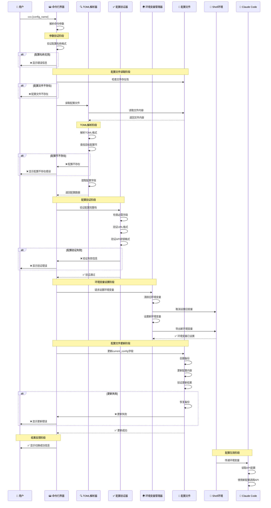
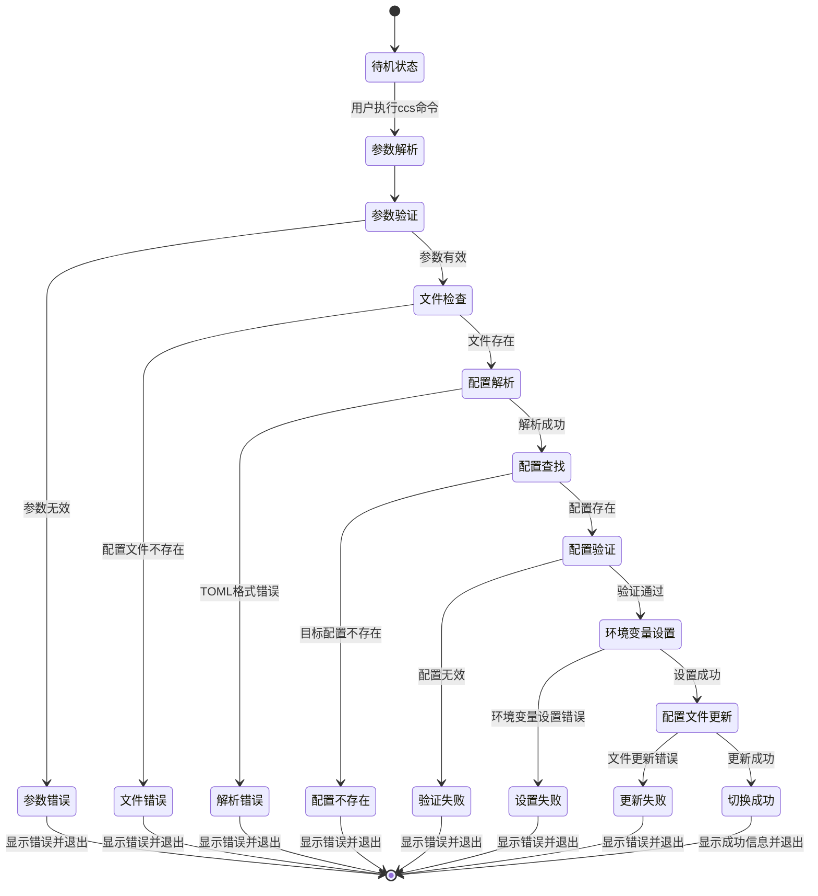
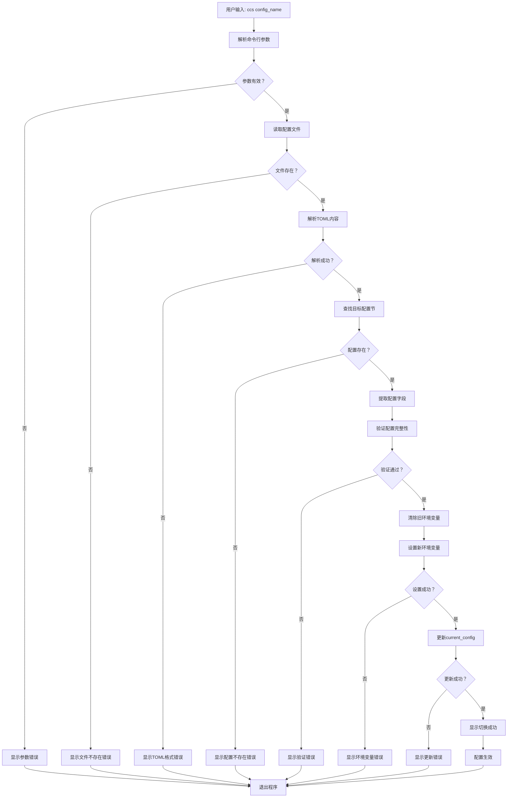
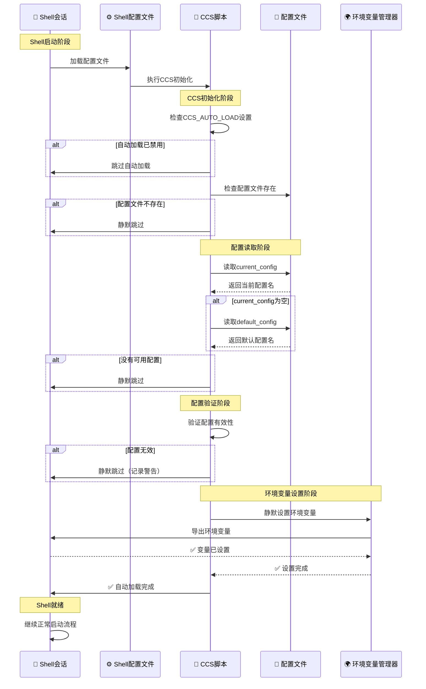
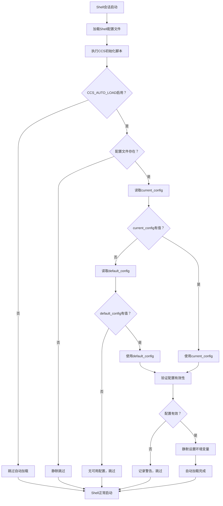
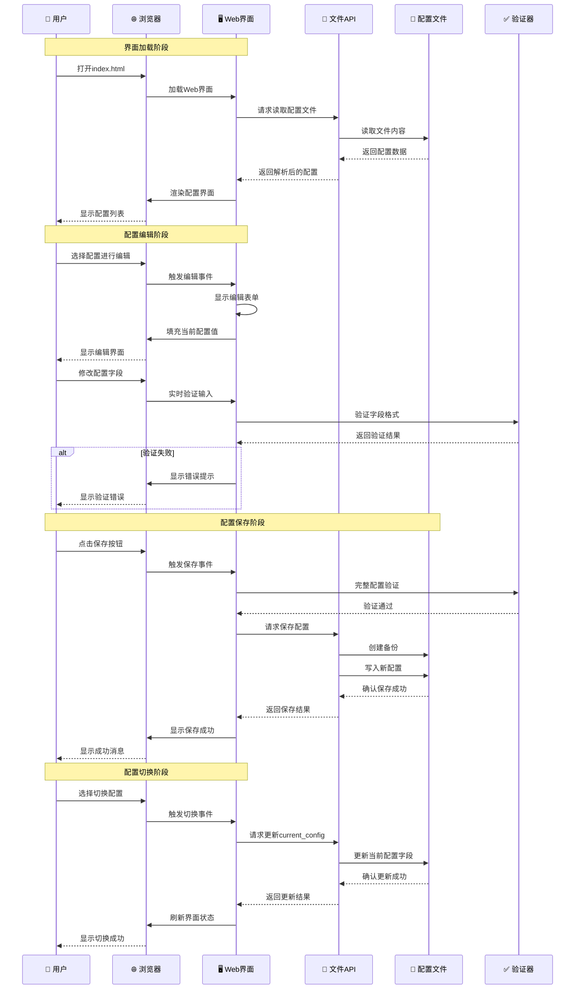
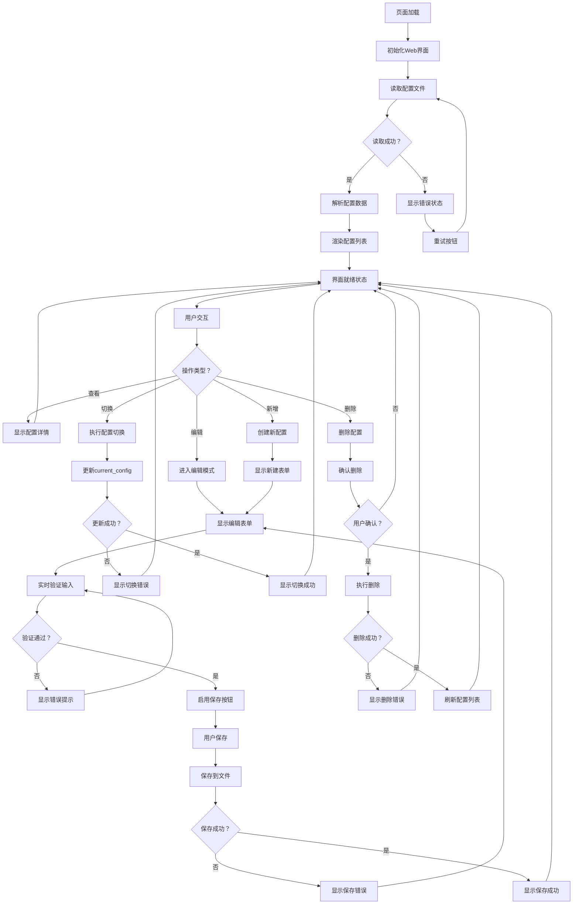
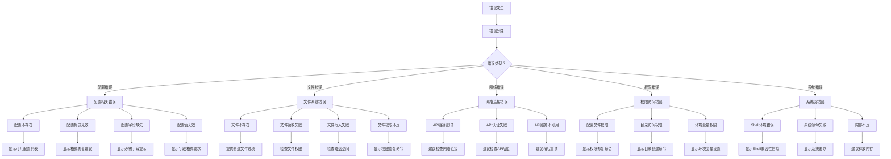
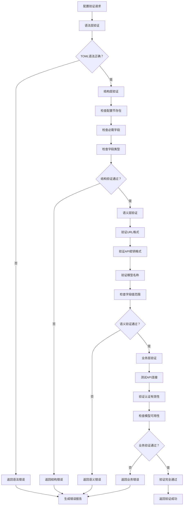
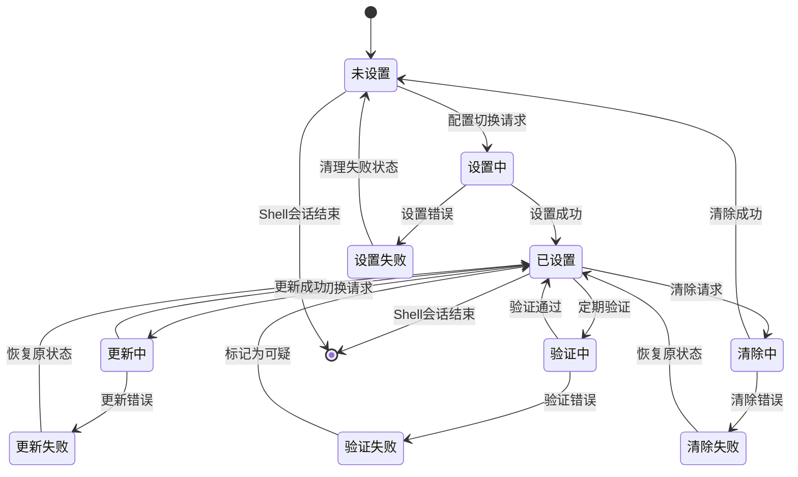

# 数据流程详解

本文档详细描述 CCS (Claude Code Configuration Switcher) 系统中的数据流程、组件交互和状态管理机制。

## 📋 目录

- [配置切换流程](#配置切换流程)
- [自动配置加载流程](#自动配置加载流程)
- [Web界面管理流程](#web界面管理流程)
- [错误处理流程](#错误处理流程)
- [配置验证流程](#配置验证流程)
- [环境变量生命周期](#环境变量生命周期)
- [多Shell环境同步](#多shell环境同步)

## 🔄 配置切换流程

### 1. 完整配置切换序列图



### 2. 配置切换状态机



### 3. 配置切换数据流



## 🚀 自动配置加载流程

### 1. Shell启动时的自动加载



### 2. 自动加载决策树



### 3. 配置优先级策略

```bash
# 配置优先级决策逻辑
get_auto_load_config() {
    local config_file="$1"
    local priority_config=""
    
    # 优先级1: 环境变量指定的配置
    if [[ -n "$CCS_FORCE_CONFIG" ]]; then
        priority_config="$CCS_FORCE_CONFIG"
        log_debug "使用强制指定配置: $priority_config"
    
    # 优先级2: current_config字段
    elif [[ -z "$priority_config" ]]; then
        priority_config=$(parse_toml "global" "$config_file" "current_config" 2>/dev/null)
        if [[ -n "$priority_config" ]]; then
            log_debug "使用当前配置: $priority_config"
        fi
    fi
    
    # 优先级3: default_config字段
    if [[ -z "$priority_config" ]]; then
        priority_config=$(parse_toml "global" "$config_file" "default_config" 2>/dev/null)
        if [[ -n "$priority_config" ]]; then
            log_debug "使用默认配置: $priority_config"
        fi
    fi
    
    # 优先级4: 第一个可用配置
    if [[ -z "$priority_config" ]]; then
        local first_config=$(list_all_configs "$config_file" | head -n1)
        if [[ -n "$first_config" ]]; then
            priority_config="$first_config"
            log_debug "使用第一个可用配置: $priority_config"
        fi
    fi
    
    echo "$priority_config"
}
```

## 🌐 Web界面管理流程

### 1. Web界面配置管理序列图



### 2. Web界面状态管理

```javascript
// Web界面状态管理对象
const CCSWebState = {
    // 当前状态
    currentState: 'loading', // loading, ready, editing, saving, error
    
    // 配置数据
    configs: {},
    currentConfig: null,
    editingConfig: null,
    
    // 状态转换函数
    setState(newState, data = {}) {
        console.log(`状态转换: ${this.currentState} -> ${newState}`);
        
        // 状态转换验证
        if (!this.isValidTransition(this.currentState, newState)) {
            console.error(`无效的状态转换: ${this.currentState} -> ${newState}`);
            return false;
        }
        
        // 执行状态转换
        this.currentState = newState;
        
        // 更新相关数据
        Object.assign(this, data);
        
        // 触发UI更新
        this.updateUI();
        
        return true;
    },
    
    // 验证状态转换是否有效
    isValidTransition(from, to) {
        const validTransitions = {
            'loading': ['ready', 'error'],
            'ready': ['editing', 'saving', 'error'],
            'editing': ['ready', 'saving', 'error'],
            'saving': ['ready', 'error'],
            'error': ['ready', 'loading']
        };
        
        return validTransitions[from]?.includes(to) || false;
    },
    
    // 更新UI界面
    updateUI() {
        switch (this.currentState) {
            case 'loading':
                this.showLoading();
                break;
            case 'ready':
                this.showConfigList();
                break;
            case 'editing':
                this.showEditForm();
                break;
            case 'saving':
                this.showSaving();
                break;
            case 'error':
                this.showError();
                break;
        }
    }
};
```

### 3. Web界面数据流



## ❌ 错误处理流程

### 1. 错误分类和处理策略



### 2. 错误恢复机制

```bash
# 错误恢复策略实现
handle_error_with_recovery() {
    local error_code="$1"
    local error_message="$2"
    local context="$3"
    local recovery_action="$4"
    
    # 记录错误详情
    log_error "错误发生 - 代码: $error_code, 消息: $error_message, 上下文: $context"
    
    # 根据错误类型执行恢复策略
    case $error_code in
        $ERROR_CONFIG_NOT_FOUND)
            recover_missing_config "$context"
            ;;
        $ERROR_CONFIG_INVALID)
            recover_invalid_config "$context"
            ;;
        $ERROR_FILE_NOT_FOUND)
            recover_missing_file "$context"
            ;;
        $ERROR_PERMISSION_DENIED)
            recover_permission_error "$context"
            ;;
        $ERROR_NETWORK_ERROR)
            recover_network_error "$context"
            ;;
        *)
            # 通用错误处理
            show_generic_error "$error_code" "$error_message"
            ;;
    esac
    
    # 执行自定义恢复动作
    if [[ -n "$recovery_action" ]] && [[ $(type -t "$recovery_action") == "function" ]]; then
        "$recovery_action" "$error_code" "$error_message" "$context"
    fi
}

# 配置不存在的恢复策略
recover_missing_config() {
    local config_name="$1"
    
    echo "❌ 配置 '$config_name' 不存在"
    echo ""
    echo "🔧 可能的解决方案:"
    echo "   1. 查看可用配置: ccs list"
    echo "   2. 创建新配置: 编辑 ~/.ccs_config.toml"
    echo "   3. 检查配置名称拼写"
    echo ""
    
    # 显示相似的配置名称
    local similar_configs=$(find_similar_configs "$config_name")
    if [[ -n "$similar_configs" ]]; then
        echo "💡 您是否想要使用以下配置？"
        echo "$similar_configs"
        echo ""
    fi
    
    # 提供交互式配置选择
    if [[ -t 0 ]]; then  # 检查是否在交互式终端中
        echo "🤔 是否要查看可用配置列表？ (y/N)"
        read -r response
        if [[ "$response" =~ ^[Yy]$ ]]; then
            list_configs
        fi
    fi
}

# 配置无效的恢复策略
recover_invalid_config() {
    local config_name="$1"
    
    echo "❌ 配置 '$config_name' 格式无效"
    echo ""
    echo "🔧 可能的解决方案:"
    echo "   1. 检查TOML语法是否正确"
    echo "   2. 验证必需字段是否存在"
    echo "   3. 检查字段值格式是否正确"
    echo ""
    
    # 尝试验证并显示具体错误
    local validation_result=$(validate_config_detailed "$config_name" 2>&1)
    if [[ -n "$validation_result" ]]; then
        echo "📋 详细验证结果:"
        echo "$validation_result"
        echo ""
    fi
    
    # 提供配置模板
    echo "📝 配置模板示例:"
    show_config_template
}

# 文件不存在的恢复策略
recover_missing_file() {
    local file_path="$1"
    
    echo "❌ 文件不存在: $file_path"
    echo ""
    echo "🔧 可能的解决方案:"
    echo "   1. 运行安装脚本重新创建文件"
    echo "   2. 手动创建配置文件"
    echo "   3. 检查文件路径是否正确"
    echo ""
    
    # 如果是配置文件，提供创建选项
    if [[ "$file_path" == *".ccs_config.toml" ]]; then
        if [[ -t 0 ]]; then  # 交互式终端
            echo "🤔 是否要创建默认配置文件？ (y/N)"
            read -r response
            if [[ "$response" =~ ^[Yy]$ ]]; then
                create_default_config_file "$file_path"
            fi
        else
            echo "💡 运行以下命令创建默认配置文件:"
            echo "   ccs --init"
        fi
    fi
}
```

### 3. 错误日志和监控

```bash
# 错误日志记录系统
setup_error_logging() {
    local log_dir="$HOME/.ccs/logs"
    local log_file="$log_dir/ccs_error.log"
    local max_log_size=10485760  # 10MB
    local max_log_files=5
    
    # 创建日志目录
    mkdir -p "$log_dir"
    
    # 设置日志文件权限
    touch "$log_file"
    chmod 600 "$log_file"
    
    # 日志轮转
    if [[ -f "$log_file" ]] && [[ $(stat -c%s "$log_file") -gt $max_log_size ]]; then
        rotate_log_files "$log_file" $max_log_files
    fi
    
    # 设置全局日志文件变量
    export CCS_ERROR_LOG="$log_file"
}

# 结构化错误日志记录
log_structured_error() {
    local timestamp=$(date -Iseconds)
    local error_code="$1"
    local error_message="$2"
    local context="$3"
    local stack_trace="$4"
    local user="$(whoami)"
    local hostname="$(hostname)"
    local shell_type="$0"
    local ccs_version="$(get_ccs_version)"
    
    # 构建JSON格式的错误日志
    local log_entry=$(cat <<EOF
{
  "timestamp": "$timestamp",
  "level": "ERROR",
  "error_code": $error_code,
  "message": "$error_message",
  "context": "$context",
  "stack_trace": "$stack_trace",
  "environment": {
    "user": "$user",
    "hostname": "$hostname",
    "shell": "$shell_type",
    "ccs_version": "$ccs_version",
    "config_file": "$CONFIG_FILE"
  }
}
EOF
    )
    
    # 写入日志文件
    if [[ -n "$CCS_ERROR_LOG" ]]; then
        echo "$log_entry" >> "$CCS_ERROR_LOG"
    fi
    
    # 发送到外部监控系统（如果配置）
    if [[ -n "$CCS_MONITORING_ENDPOINT" ]]; then
        send_error_to_monitoring "$log_entry"
    fi
}
```

## ✅ 配置验证流程

### 1. 多层次验证架构



### 2. 验证规则引擎

```bash
# 配置验证规则定义
declare -A VALIDATION_RULES=(
    # 必需字段规则
    ["required_fields"]="base_url,auth_token"
    
    # 字段格式规则
    ["base_url_pattern"]="^https?://[a-zA-Z0-9.-]+(/.*)?$"
    ["auth_token_min_length"]="10"
    ["model_name_pattern"]="^[a-zA-Z0-9._-]+$"
    ["description_max_length"]="200"
    
    # 字段值范围规则
    ["base_url_max_length"]="500"
    ["auth_token_max_length"]="1000"
    ["model_name_max_length"]="100"
)

# 执行配置验证
validate_config_comprehensive() {
    local config_name="$1"
    local config_file="$2"
    local validation_level="$3"  # basic, full, strict
    
    local validation_errors=()
    local validation_warnings=()
    
    # 1. 语法层验证
    if ! validate_toml_syntax "$config_file"; then
        validation_errors+=("TOML语法错误")
        return 1
    fi
    
    # 2. 结构层验证
    local structure_result=$(validate_config_structure "$config_name" "$config_file")
    if [[ $? -ne 0 ]]; then
        validation_errors+=("$structure_result")
    fi
    
    # 3. 语义层验证
    local semantic_result=$(validate_config_semantics "$config_name" "$config_file")
    if [[ $? -ne 0 ]]; then
        validation_errors+=("$semantic_result")
    fi
    
    # 4. 业务层验证（仅在full或strict级别）
    if [[ "$validation_level" == "full" ]] || [[ "$validation_level" == "strict" ]]; then
        local business_result=$(validate_config_business "$config_name" "$config_file")
        if [[ $? -ne 0 ]]; then
            if [[ "$validation_level" == "strict" ]]; then
                validation_errors+=("$business_result")
            else
                validation_warnings+=("$business_result")
            fi
        fi
    fi
    
    # 生成验证报告
    generate_validation_report "$config_name" validation_errors validation_warnings
    
    # 返回验证结果
    if [[ ${#validation_errors[@]} -eq 0 ]]; then
        return 0
    else
        return 1
    fi
}

# 结构层验证
validate_config_structure() {
    local config_name="$1"
    local config_file="$2"
    
    # 检查配置节是否存在
    if ! grep -q "^\[$config_name\]" "$config_file"; then
        echo "配置节 [$config_name] 不存在"
        return 1
    fi
    
    # 检查必需字段
    local required_fields=(${VALIDATION_RULES["required_fields"]//,/ })
    for field in "${required_fields[@]}"; do
        local field_value=$(parse_toml "$config_name" "$config_file" "$field")
        if [[ -z "$field_value" ]]; then
            echo "缺少必需字段: $field"
            return 1
        fi
    done
    
    return 0
}

# 语义层验证
validate_config_semantics() {
    local config_name="$1"
    local config_file="$2"
    
    # 验证base_url格式
    local base_url=$(parse_toml "$config_name" "$config_file" "base_url")
    if [[ -n "$base_url" ]]; then
        local url_pattern="${VALIDATION_RULES["base_url_pattern"]}"
        if [[ ! "$base_url" =~ $url_pattern ]]; then
            echo "base_url格式无效: $base_url"
            return 1
        fi
        
        local max_length="${VALIDATION_RULES["base_url_max_length"]}"
        if [[ ${#base_url} -gt $max_length ]]; then
            echo "base_url长度超过限制: ${#base_url} > $max_length"
            return 1
        fi
    fi
    
    # 验证auth_token格式
    local auth_token=$(parse_toml "$config_name" "$config_file" "auth_token")
    if [[ -n "$auth_token" ]]; then
        local min_length="${VALIDATION_RULES["auth_token_min_length"]}"
        if [[ ${#auth_token} -lt $min_length ]]; then
            echo "auth_token长度过短: ${#auth_token} < $min_length"
            return 1
        fi
        
        local max_length="${VALIDATION_RULES["auth_token_max_length"]}"
        if [[ ${#auth_token} -gt $max_length ]]; then
            echo "auth_token长度超过限制: ${#auth_token} > $max_length"
            return 1
        fi
    fi
    
    # 验证模型名称格式
    local model=$(parse_toml "$config_name" "$config_file" "model")
    if [[ -n "$model" ]]; then
        local model_pattern="${VALIDATION_RULES["model_name_pattern"]}"
        if [[ ! "$model" =~ $model_pattern ]]; then
            echo "模型名称格式无效: $model"
            return 1
        fi
    fi
    
    return 0
}

# 业务层验证
validate_config_business() {
    local config_name="$1"
    local config_file="$2"
    
    local base_url=$(parse_toml "$config_name" "$config_file" "base_url")
    local auth_token=$(parse_toml "$config_name" "$config_file" "auth_token")
    
    # 测试API连接
    if ! test_api_connection "$base_url" "$auth_token"; then
        echo "API连接测试失败: $base_url"
        return 1
    fi
    
    # 验证认证有效性
    if ! test_api_authentication "$base_url" "$auth_token"; then
        echo "API认证失败，请检查auth_token"
        return 1
    fi
    
    # 检查模型可用性
    local model=$(parse_toml "$config_name" "$config_file" "model")
    if [[ -n "$model" ]] && ! test_model_availability "$base_url" "$auth_token" "$model"; then
        echo "模型不可用: $model"
        return 1
    fi
    
    return 0
}
```

## 🔄 环境变量生命周期

### 1. 环境变量生命周期管理



### 2. 环境变量同步机制

```bash
# 环境变量同步管理器
class EnvVarSyncManager {
    # 同步状态跟踪
    local sync_state="idle"  # idle, syncing, error
    local last_sync_time=0
    local sync_interval=300  # 5分钟
    
    # 启动同步监控
    start_sync_monitoring() {
        # 设置定期同步检查
        while true; do
            sleep $sync_interval
            check_and_sync_env_vars
        done &
        
        local sync_pid=$!
        echo $sync_pid > "$HOME/.ccs/sync.pid"
        log_info "环境变量同步监控已启动 (PID: $sync_pid)"
    }
    
    # 检查并同步环境变量
    check_and_sync_env_vars() {
        local current_time=$(date +%s)
        
        # 检查是否需要同步
        if [[ $((current_time - last_sync_time)) -lt $sync_interval ]]; then
            return 0
        fi
        
        sync_state="syncing"
        
        # 读取当前配置
        local current_config=$(get_current_config)
        if [[ -z "$current_config" ]]; then
            sync_state="idle"
            return 0
        fi
        
        # 检查环境变量是否与配置一致
        if ! verify_env_vars_consistency "$current_config"; then
            log_warn "检测到环境变量不一致，正在重新同步"
            
            # 重新设置环境变量
            if set_config_env_vars "$current_config" "$CONFIG_FILE"; then
                log_info "环境变量已重新同步"
            else
                log_error "环境变量同步失败"
                sync_state="error"
                return 1
            fi
        fi
        
        last_sync_time=$current_time
        sync_state="idle"
        return 0
    }
    
    # 验证环境变量一致性
    verify_env_vars_consistency() {
        local config_name="$1"
        
        # 检查每个环境变量
        for env_var in "${CCS_ENV_VARS[@]}"; do
            local field_name="${ENV_FIELD_MAP[$env_var]}"
            local expected_value=$(parse_toml "$config_name" "$CONFIG_FILE" "$field_name")
            local actual_value="${!env_var}"
            
            if [[ "$expected_value" != "$actual_value" ]]; then
                log_debug "环境变量不一致: $env_var (期望: $expected_value, 实际: $actual_value)"
                return 1
            fi
        done
        
        return 0
    }
}
```

---

**相关文档**：
- [项目架构](architecture.md) - 整体架构设计
- [核心组件](components.md) - 组件详细说明
- [故障排除](troubleshooting.md) - 问题诊断和解决