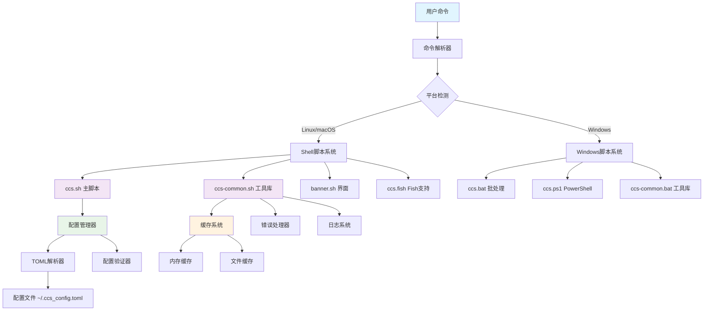
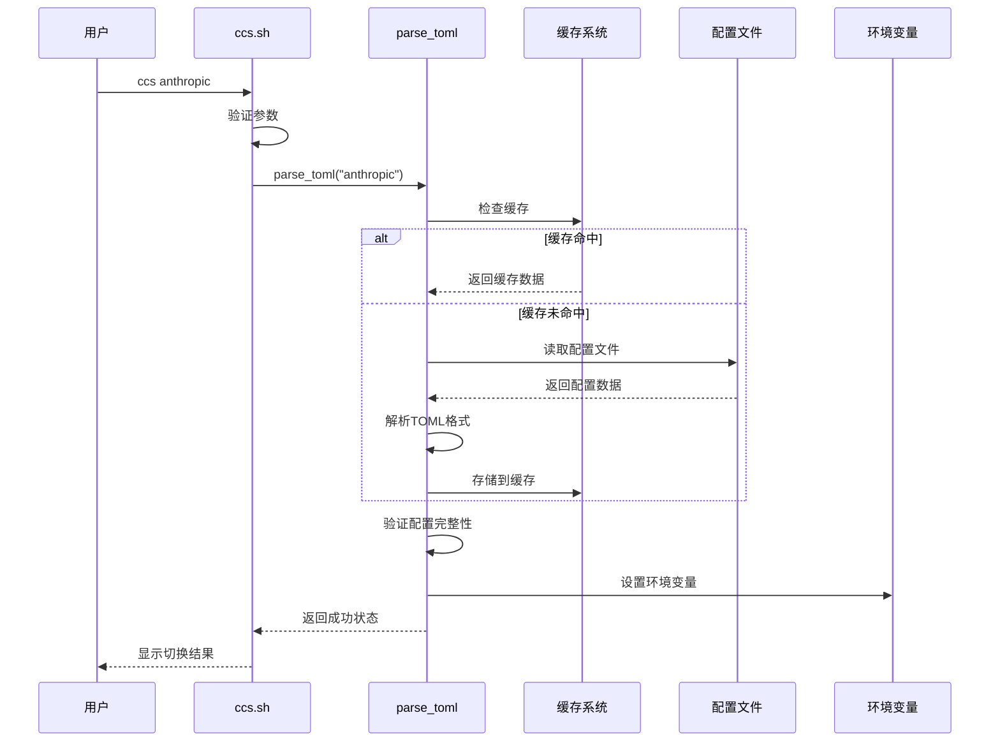
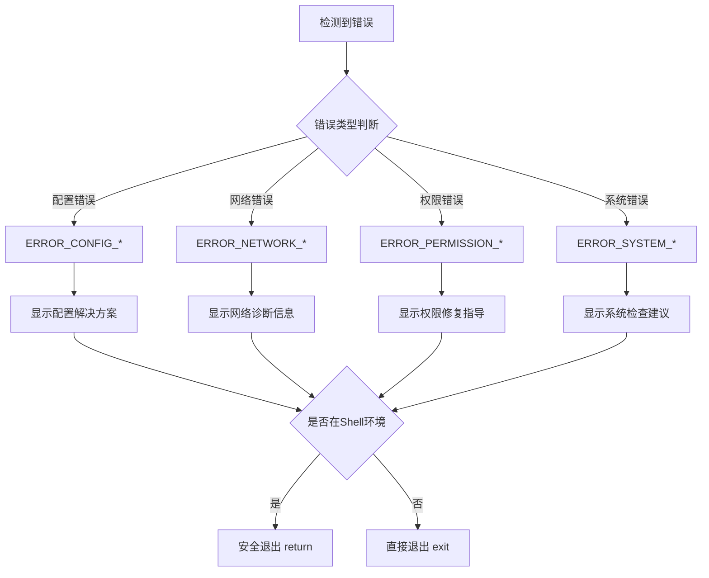

# 系统架构概览

CCS (Claude Code Configuration Switcher) 是一个高性能、跨平台的API配置切换工具，采用模块化设计理念，支持多种Shell环境和操作系统。

## 🏗️ 整体架构



## 📦 核心模块

### 1. 命令解析与路由系统

**位置**: `scripts/shell/ccs.sh` (主函数)

**功能**:
- 命令行参数解析和验证
- 命令路由和分发
- 参数预处理和标准化

**关键特性**:
```bash
# 支持的命令格式
ccs [config_name]           # 切换到指定配置
ccs list                    # 列出所有配置
ccs current                 # 显示当前配置
ccs web                     # 启动Web界面
ccs version                 # 显示版本信息
```

### 2. 配置管理系统

**位置**: `scripts/shell/ccs-common.sh` (parse_toml函数)

**功能**:
- TOML配置文件解析
- 配置验证和完整性检查
- 环境变量设置和管理
- 配置缓存和优化

**技术实现**:
```bash
# 配置解析流程
parse_toml() {
    local config_name="$1"
    local silent_mode="${2:-false}"
    
    # 1. 缓存检查
    if check_cache "$config_name"; then
        load_from_cache "$config_name"
        return 0
    fi
    
    # 2. 文件解析
    parse_config_section "$config_name"
    
    # 3. 验证配置
    validate_config_fields
    
    # 4. 缓存存储
    store_to_cache "$config_name"
    
    # 5. 环境变量设置
    export_config_vars
}
```

### 3. 缓存系统

**位置**: `scripts/shell/ccs-common.sh` (缓存相关函数)

**功能**:
- 配置数据缓存 (TTL: 300秒)
- 性能优化和快速访问
- 自动缓存清理和更新

**缓存策略**:
```bash
# 缓存数据结构
declare -A _config_cache          # 配置数据缓存
declare -A _config_cache_timestamp # 缓存时间戳

# 缓存检查逻辑
check_cache() {
    local config_name="$1"
    local current_time=$(date +%s)
    local cache_time="${_config_cache_timestamp[$config_name]:-0}"
    
    # TTL检查 (300秒)
    if [[ $((current_time - cache_time)) -lt $CCS_CACHE_TTL ]]; then
        return 0  # 缓存有效
    else
        return 1  # 缓存过期
    fi
}
```

### 4. 错误处理系统

**位置**: `scripts/shell/ccs-common.sh` (handle_error函数)

**功能**:
- 统一错误处理和分类
- 详细错误信息和解决方案
- 安全退出机制

**错误码分类**:
```bash
# 错误码定义
readonly ERROR_SUCCESS=0
readonly ERROR_CONFIG_MISSING=1      # 配置文件缺失
readonly ERROR_CONFIG_INVALID=2      # 配置格式错误
readonly ERROR_DOWNLOAD_FAILED=3     # 下载失败
readonly ERROR_PERMISSION_DENIED=4   # 权限不足
readonly ERROR_FILE_NOT_FOUND=5      # 文件未找到
readonly ERROR_INVALID_ARGUMENT=6    # 参数错误
readonly ERROR_NETWORK_UNREACHABLE=7 # 网络不可达
readonly ERROR_DEPENDENCY_MISSING=8  # 依赖缺失
readonly ERROR_CONFIGURATION_CORRUPT=9 # 配置损坏
readonly ERROR_RESOURCE_BUSY=10      # 资源忙
readonly ERROR_TIMEOUT=11            # 超时
readonly ERROR_AUTHENTICATION_FAILED=12 # 认证失败
readonly ERROR_UNKNOWN=99            # 未知错误
```

### 5. 日志系统

**位置**: `scripts/shell/ccs-common.sh` (日志函数)

**功能**:
- 多级别日志记录
- 彩色输出和格式化
- 调试信息和性能监控

**日志级别**:
```bash
# 日志级别定义
readonly LOG_LEVEL_DEBUG=0   # 调试信息
readonly LOG_LEVEL_INFO=1    # 一般信息
readonly LOG_LEVEL_WARN=2    # 警告信息
readonly LOG_LEVEL_ERROR=3   # 错误信息
readonly LOG_LEVEL_OFF=4     # 关闭日志

# 使用示例
log_debug "配置缓存命中: $config_name"
log_info "切换到配置: $config_name"
log_warn "配置文件版本过旧"
log_error "配置解析失败: $error_message"
```

## 🔄 数据流程

### 配置切换流程



### 错误处理流程



## 🚀 性能优化

### 1. 缓存优化
- **内存缓存**: 使用关联数组存储解析后的配置
- **TTL机制**: 300秒生存时间，平衡性能和数据新鲜度
- **智能失效**: 配置文件修改时自动清理相关缓存

### 2. 并发处理
- **异步执行**: 支持后台任务和并行处理
- **资源锁定**: 防止并发访问冲突
- **超时控制**: 避免长时间阻塞

### 3. 启动优化
- **延迟加载**: 按需加载功能模块
- **依赖检查**: 智能检测和跳过不必要的依赖
- **快速路径**: 常用命令的优化执行路径

## 🔒 安全特性

### 1. 权限控制
- **文件权限检查**: 验证脚本和配置文件权限
- **执行权限验证**: 确保必要的执行权限
- **路径安全**: 防止路径遍历攻击

### 2. 数据保护
- **配置备份**: 自动备份重要配置文件
- **完整性验证**: 检查配置文件完整性
- **敏感信息保护**: API密钥的安全处理

### 3. 环境隔离
- **Shell环境检测**: 智能检测当前Shell环境
- **安全退出**: 在不同环境中的安全退出机制
- **变量作用域**: 严格控制变量作用域

## 📊 监控与诊断

### 1. 性能监控
```bash
# 性能统计示例
profile_function() {
    local func_name="$1"
    local start_time=$(date +%s.%N)
    
    "$@"  # 执行函数
    
    local end_time=$(date +%s.%N)
    local duration=$(echo "$end_time - $start_time" | bc)
    log_debug "Performance: $func_name took ${duration}s"
}
```

### 2. 系统诊断
- **依赖检查**: 自动检测必需和可选依赖
- **环境验证**: 验证Shell环境和系统配置
- **网络测试**: 检查网络连接和API可达性

### 3. 故障排除
- **详细日志**: 提供详细的调试信息
- **错误追踪**: 完整的错误调用栈
- **修复建议**: 针对性的问题解决方案

---

下一节: [核心组件详解](/architecture/components)